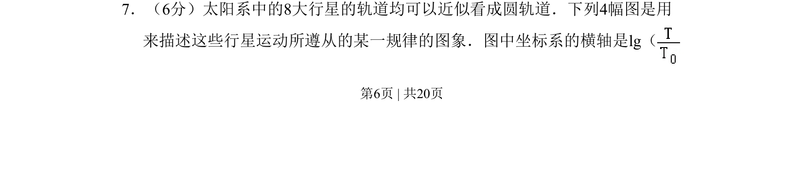
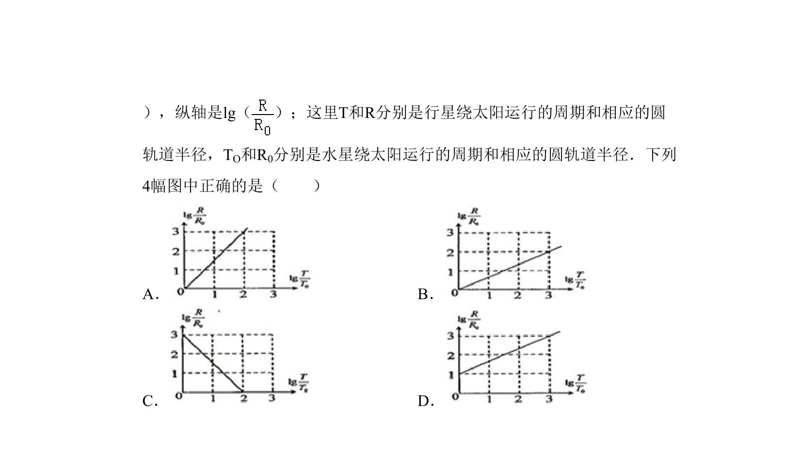
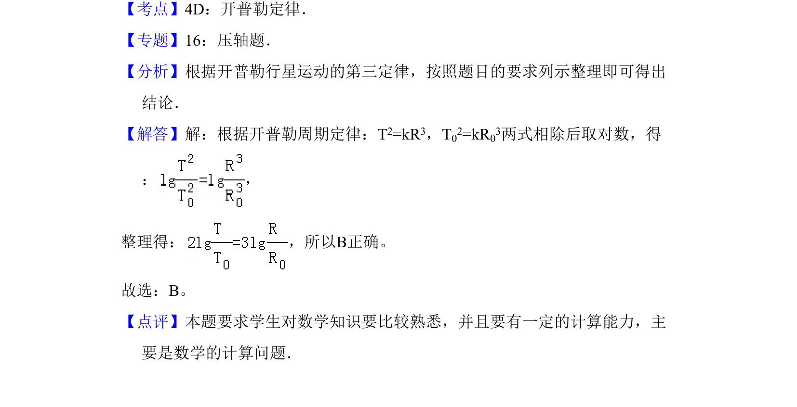

## 题面

## 摘要

考查行星运动规律的对数坐标图分析，涉及物理量线性化处理。

## 关联考点

- [[298-对数函数|对数函数]]
- [[266-开普勒第三定律|开普勒第三定律]]
- [[464-图像识别|图像识别]]

## 答案与解析

> 📄 原 PDF 第 6 页：`素材/真题/吉林/2008-2024·（吉林）物理高考真题/2010年高考物理试卷（新课标Ⅰ）（解析卷）.pdf`
