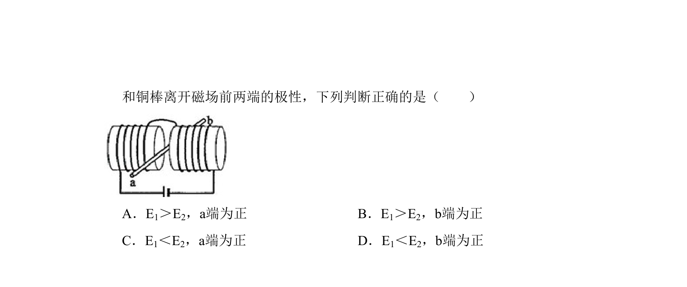
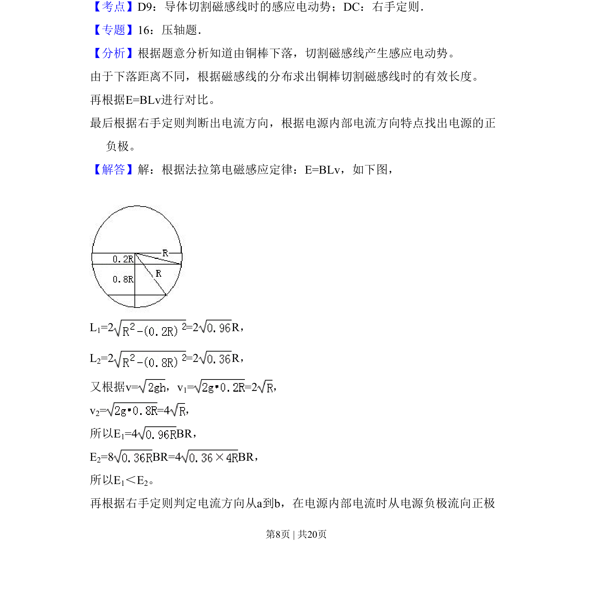
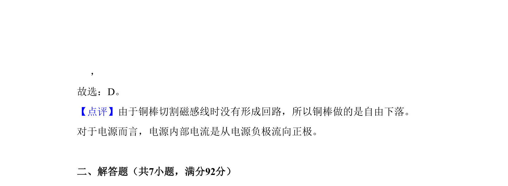

## 题面

## 摘要

铜棒在匀强磁场中下落切割磁感线，根据几何关系求有效切割长度再比较感应电动势大小。

## 关联考点

- [[175-电磁感应|电磁感应]]
- [[538-动生电动势|动生电动势]]
- [[774-有效切割长度|有效切割长度]]
- [[559-右手定则或楞次定律|右手定则或楞次定律]]

## 答案与解析

> 📄 原 PDF 第 7 页：`素材/真题/吉林/2008-2024·（吉林）物理高考真题/2010年高考物理试卷（新课标Ⅰ）（解析卷）.pdf`
