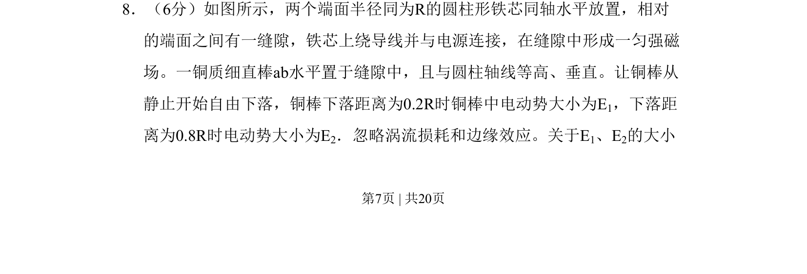

## 题面

## 摘要

铜棒在匀强磁场中自由下落切割磁感线，比较不同下落距离时的感应电动势大小。

## 关联考点

- [[395-法拉第电磁感应定律|法拉第电磁感应定律]]
- [[导体切割磁感线]]
- [[292-匀强磁场|匀强磁场]]

## 答案与解析

> 📄 原 PDF 第 7 页：`素材/真题/吉林/2008-2024·（吉林）物理高考真题/2010年高考物理试卷（新课标Ⅰ）（解析卷）.pdf`
