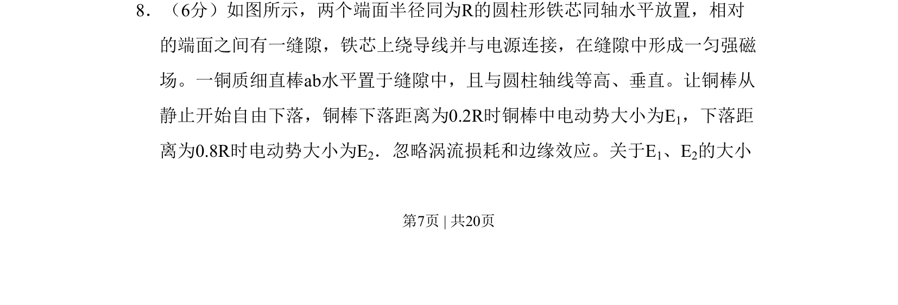
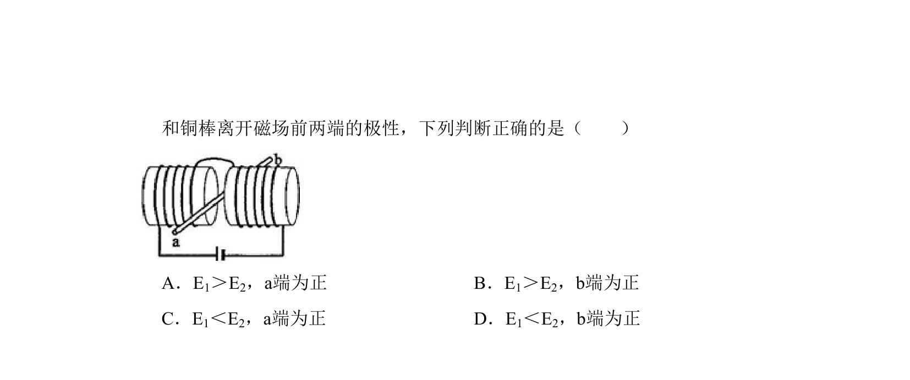
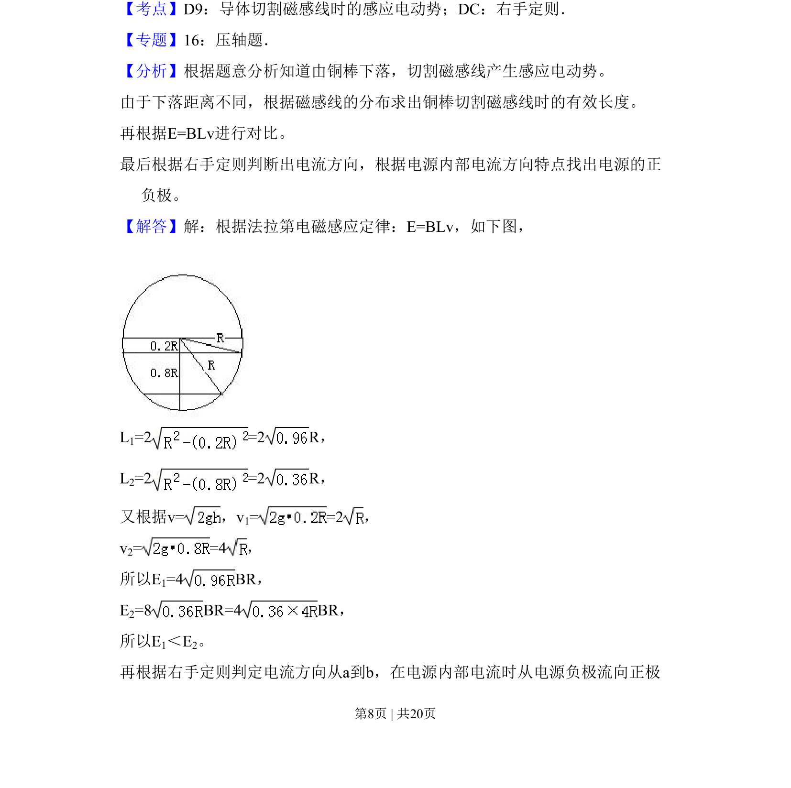
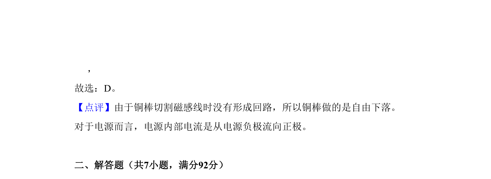

## 题面

## 摘要

铜棒在匀强磁场中下落切割磁感线，根据几何关系求有效切割长度再比较感应电动势大小。

## 关联考点

- [[175-电磁感应|电磁感应]]
- [[538-动生电动势|动生电动势]]
- [[773-有效切割长度|有效切割长度]]
- [[559-右手定则或楞次定律|右手定则或楞次定律]]

## 答案与解析

> 📄 原 PDF 第 7 页：`素材/真题/吉林/2008-2024·（吉林）物理高考真题/2010年高考物理试卷（新课标Ⅰ）（解析卷）.pdf`

<!-- 题干文本-start -->
## 题干文本
8．（6分）如图所示，两个端面半径同为R的圆柱形铁芯同轴水平放置，相对
的端面之间有一缝隙，铁芯上绕导线并与电源连接，在缝隙中形成一匀强磁
场。一铜质细直棒ab水平置于缝隙中，且与圆柱轴线等高、垂直。让铜棒从
静止开始自由下落，铜棒下落距离为0.2R时铜棒中电动势大小为E1，下落距
离为0.8R时电动势大小为E2．忽略涡流损耗和边缘效应。关于E1、E2的大小
<!-- 题干文本-end -->

<!-- 解析文本-start -->
## 解析文本

<!-- 解析文本-end -->
