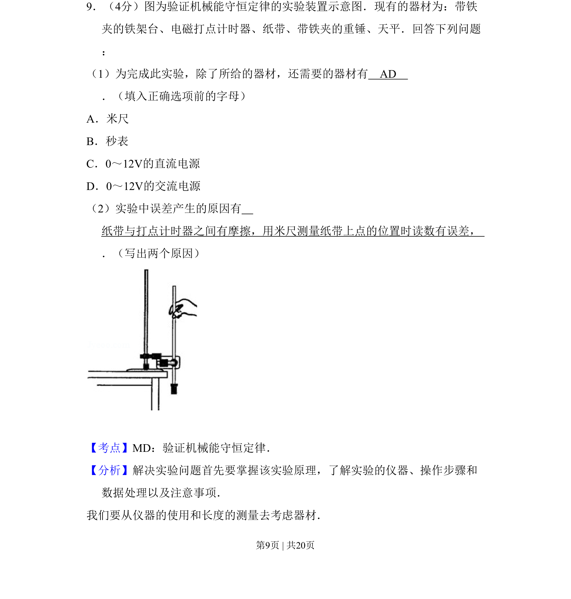
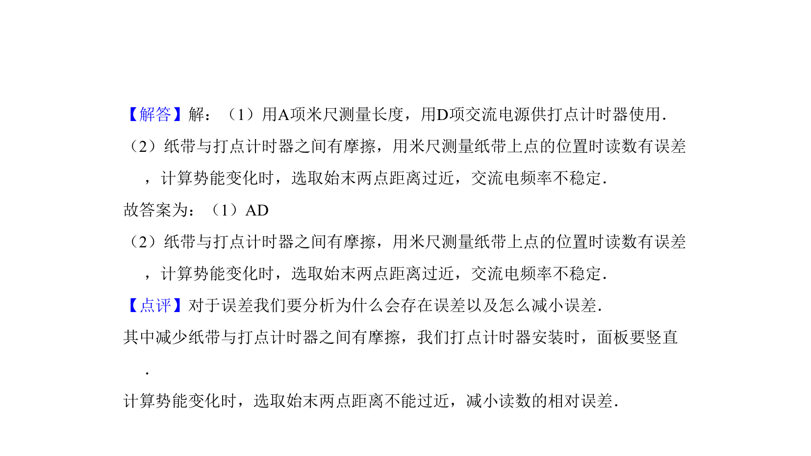

## 题面

## 摘要

考查验证机械能守恒定律实验的器材选择和误差分析。

## 关联考点

- [[752-验证机械能守恒定律|验证机械能守恒定律]]
- [[579-实验器材|实验器材]]
- [[725-误差分析|误差分析]]

## 答案与解析

> 📄 原 PDF 第 9 页：`素材/真题/吉林/2008-2024·（吉林）物理高考真题/2010年高考物理试卷（新课标Ⅰ）（解析卷）.pdf`
