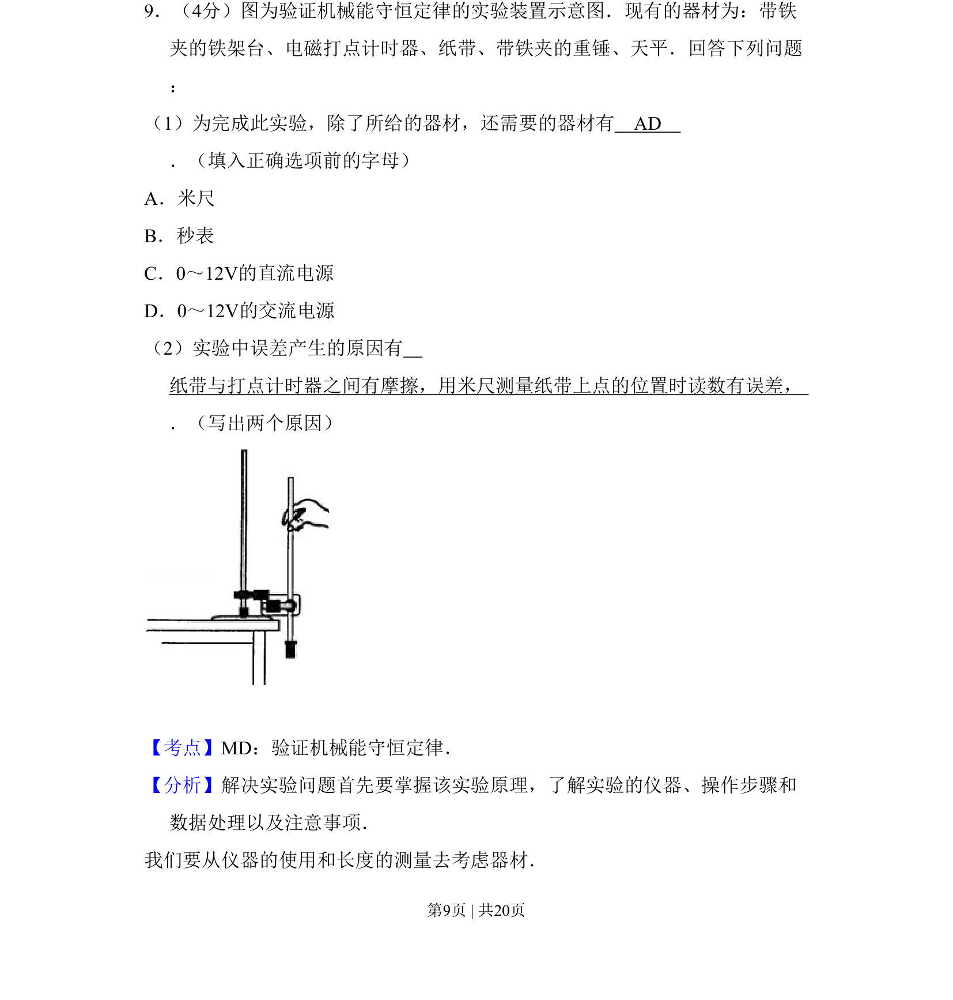
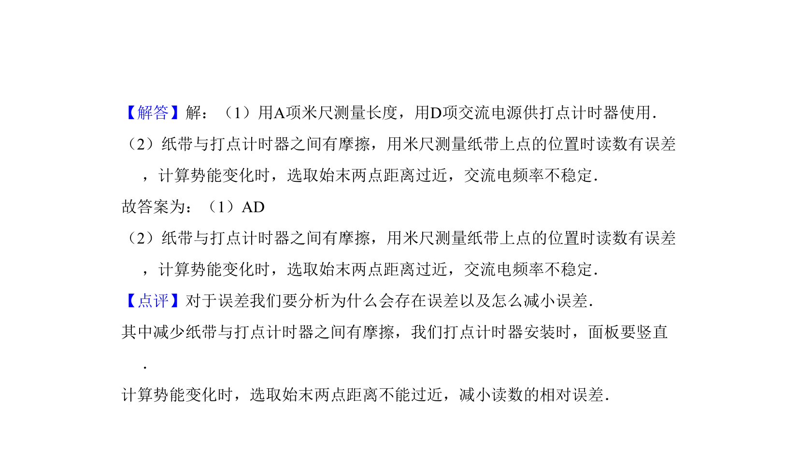

## 题面

## 摘要

考查验证机械能守恒定律实验的器材选择和误差分析。

## 关联考点

- [[751-验证机械能守恒定律|验证机械能守恒定律]]
- [[579-实验器材|实验器材]]
- [[724-误差分析|误差分析]]

## 答案与解析

> 📄 原 PDF 第 9 页：`素材/真题/吉林/2008-2024·（吉林）物理高考真题/2010年高考物理试卷（新课标Ⅰ）（解析卷）.pdf`

<!-- 题干文本-start -->
## 题干文本
9．（4分）图为验证机械能守恒定律的实验装置示意图．现有的器材为：带铁
夹的铁架台、电磁打点计时器、纸带、带铁夹的重锤、天平．回答下列问题
：
（1）为完成此实验，除了所给的器材，还需要的器材有　AD　
．（填入正确选项前的字母）
A．米尺
B．秒表
C．0～12V的直流电源
D．0～12V的交流电源
（2）实验中误差产生的原因有　
纸带与打点计时器之间有摩擦，用米尺测量纸带上点的位置时读数有误差，　
．（写出两个原因）
<!-- 题干文本-end -->

<!-- 解析文本-start -->
## 解析文本
【考点】MD：验证机械能守恒定律．菁优网版权所有
【分析】解决实验问题首先要掌握该实验原理，了解实验的仪器、操作步骤和
数据处理以及注意事项．
我们要从仪器的使用和长度的测量去考虑器材．
<!-- 解析文本-end -->
