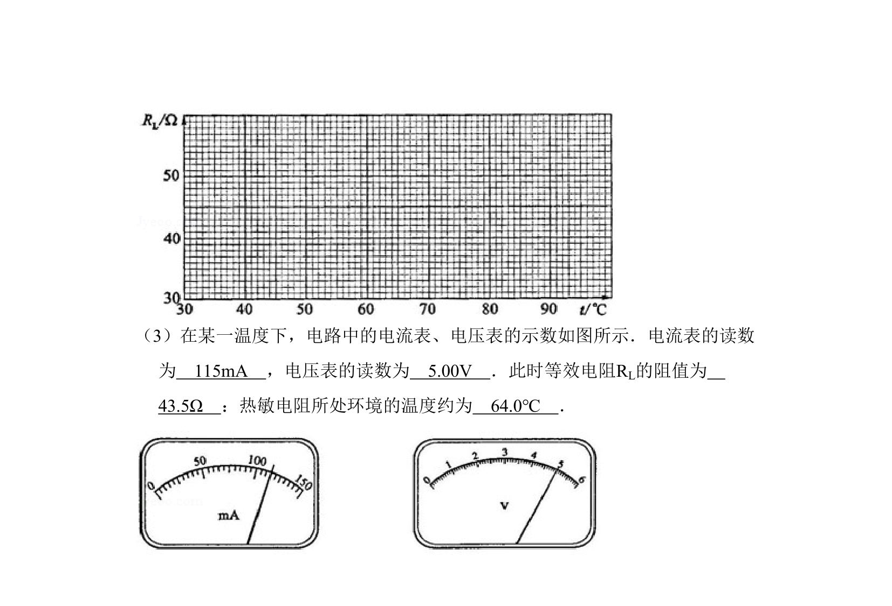
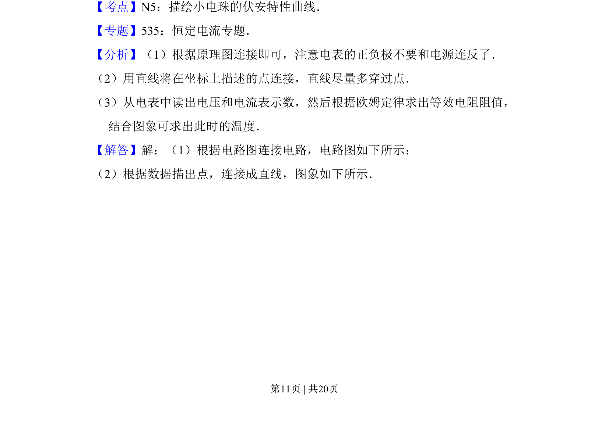
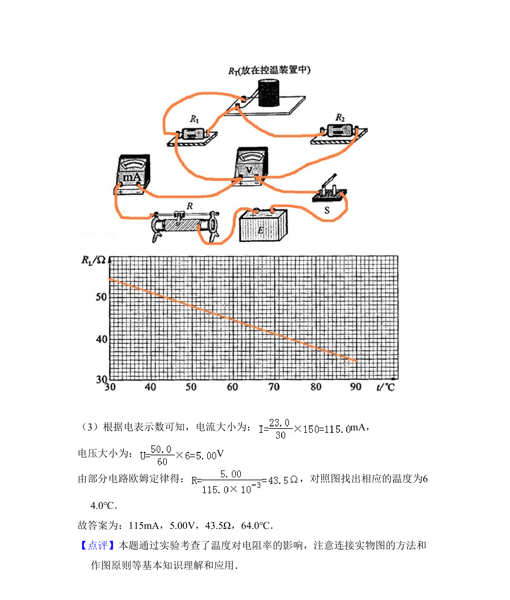

## 题面

## 摘要

该题考查利用伏安法测量热敏电阻等效电阻，并通过作图验证其线性关系的实验设计与数据处理。

## 关联考点

- [[186-电阻测量-伏安法|伏安法]]
- [[线性关系验证]]
- [[热敏电阻特性]]
- [[实验数据处理]]

## 答案与解析

> 📄 原 PDF 第 10 页：`素材/真题/吉林/2008-2024·（吉林）物理高考真题/2010年高考物理试卷（新课标Ⅰ）（解析卷）.pdf`
