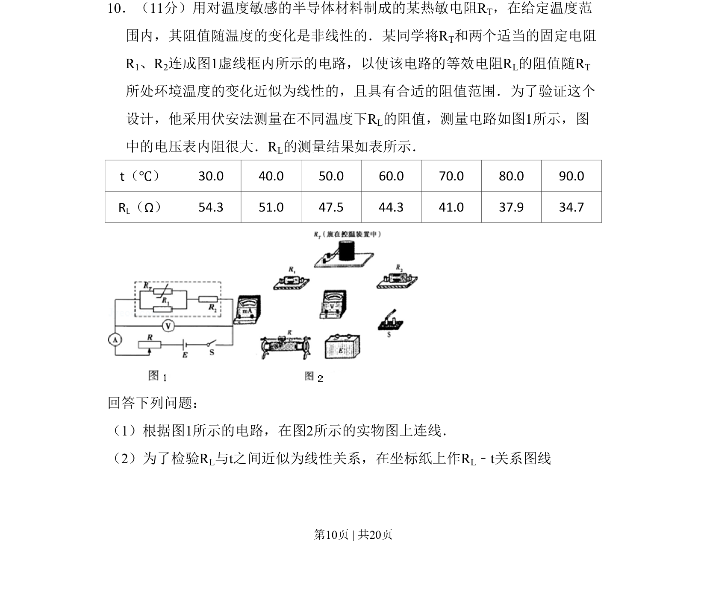
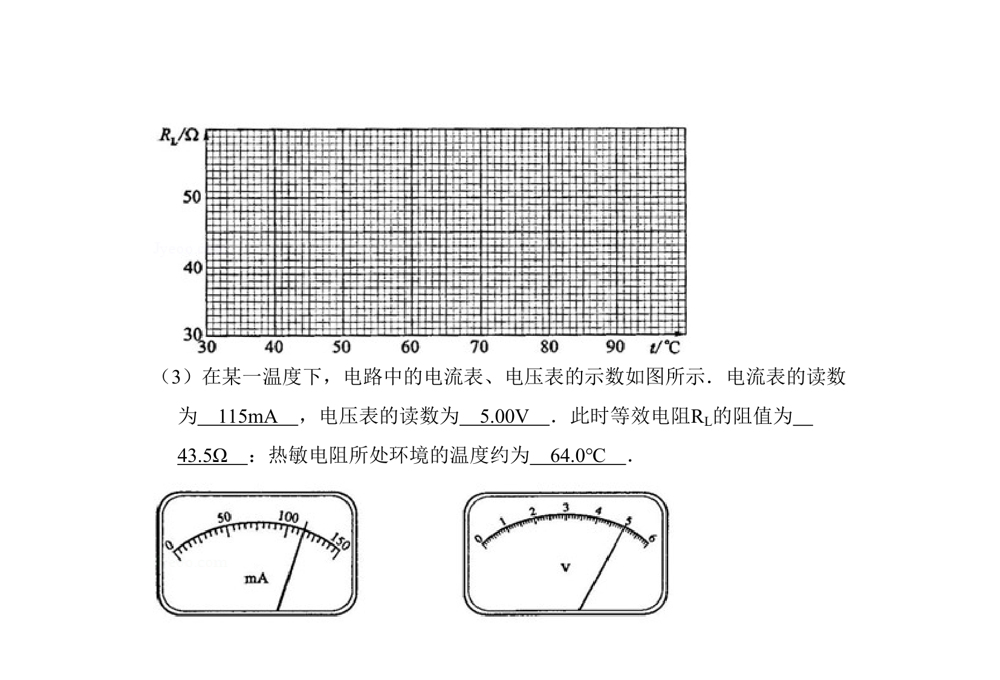
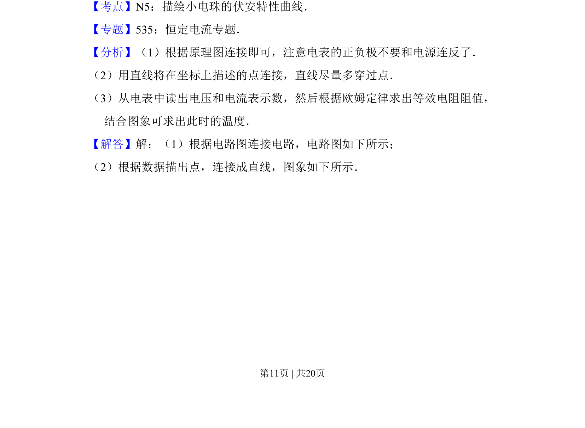
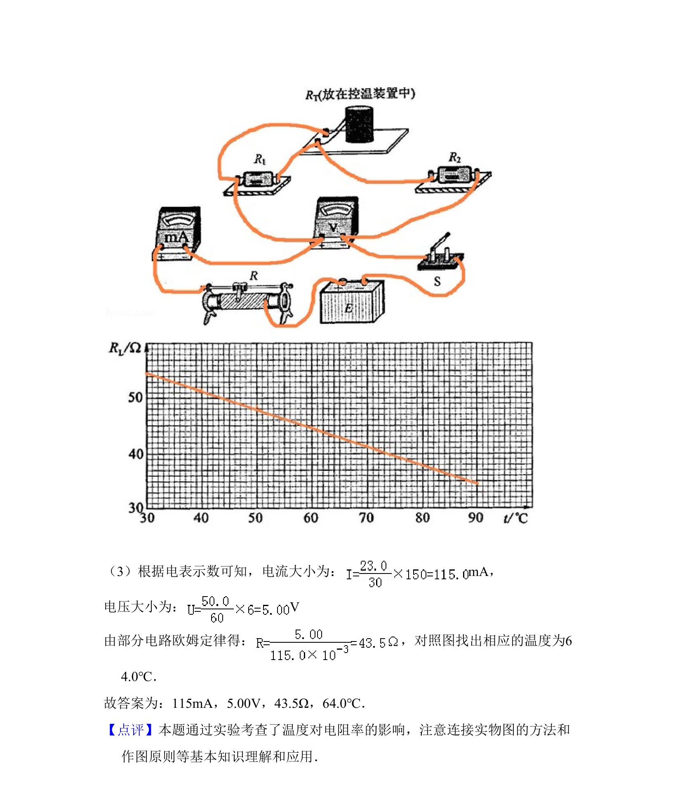

## 题面

## 摘要

该题考查利用伏安法测量热敏电阻等效电阻，并通过作图验证其线性关系的实验设计与数据处理。

## 关联考点

- [[186-电阻测量-伏安法|伏安法]]
- [[716-线性关系验证|线性关系验证]]
- [[481-热敏电阻特性|热敏电阻特性]]
- [[582-实验数据处理|实验数据处理]]

## 答案与解析

> 📄 原 PDF 第 10 页：`素材/真题/吉林/2008-2024·（吉林）物理高考真题/2010年高考物理试卷（新课标Ⅰ）（解析卷）.pdf`

<!-- 题干文本-start -->
## 题干文本
10．（11分）用对温度敏感的半导体材料制成的某热敏电阻RT，在给定温度范
围内，其阻值随温度的变化是非线性的．某同学将RT和两个适当的固定电阻
R1、R2连成图1虚线框内所示的电路，以使该电路的等效电阻RL的阻值随RT
所处环境温度的变化近似为线性的，且具有合适的阻值范围．为了验证这个
设计，他采用伏安法测量在不同温度下RL的阻值，测量电路如图1所示，图
中的电压表内阻很大．RL的测量结果如表所示．
t（℃） 30.0 40.0 50.0 60.0 70.0 80.0 90.0
RL（Ω） 54.3 51.0 47.5 44.3 41.0 37.9 34.7
回答下列问题：
（1）根据图1所示的电路，在图2所示的实物图上连线．
（2）为了检验RL与t之间近似为线性关系，在坐标纸上作RL﹣t关系图线
<!-- 题干文本-end -->

<!-- 解析文本-start -->
## 解析文本

<!-- 解析文本-end -->
