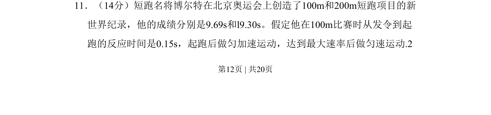

## 题面

## 摘要

本题通过博尔特短跑数据，考查匀加速与匀速运动组合过程的位移-时间关系及最大速率求解。

## 关联考点

- [[匀加速运动]]
- [[010-匀速直线运动|匀速运动]]
- [[203-位移-矢量|位移]]
- [[023-时间-钟表|时间]]

## 答案与解析

> 📄 原 PDF 第 12 页：`素材/真题/吉林/2008-2024·（吉林）物理高考真题/2010年高考物理试卷（新课标Ⅰ）（解析卷）.pdf`
