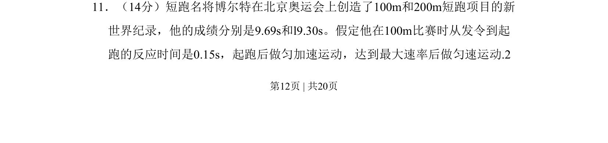
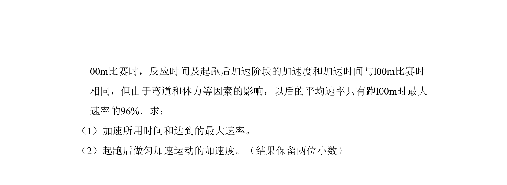
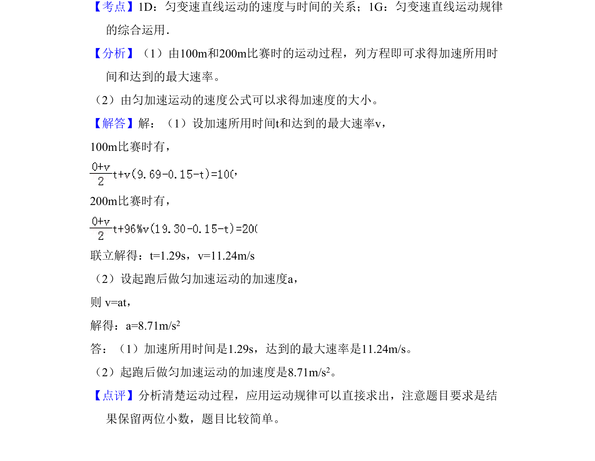

## 题面

## 摘要

本题通过博尔特短跑数据，考查匀加速与匀速运动组合过程的位移-时间关系及最大速率求解。

## 关联考点

- [[541-匀加速运动|匀加速运动]]
- [[010-匀速直线运动|匀速运动]]
- [[203-位移-矢量|位移]]
- [[023-时间-钟表|时间]]

## 答案与解析

> 📄 原 PDF 第 12 页：`素材/真题/吉林/2008-2024·（吉林）物理高考真题/2010年高考物理试卷（新课标Ⅰ）（解析卷）.pdf`

<!-- 题干文本-start -->
## 题干文本
11．（14分）短跑名将博尔特在北京奥运会上创造了100m和200m短跑项目的新
世界纪录，他的成绩分别是9.69s和l9.30s。假定他在100m比赛时从发令到起
跑的反应时间是0.15s，起跑后做匀加速运动，达到最大速率后做匀速运动.2
<!-- 题干文本-end -->

<!-- 解析文本-start -->
## 解析文本

<!-- 解析文本-end -->
