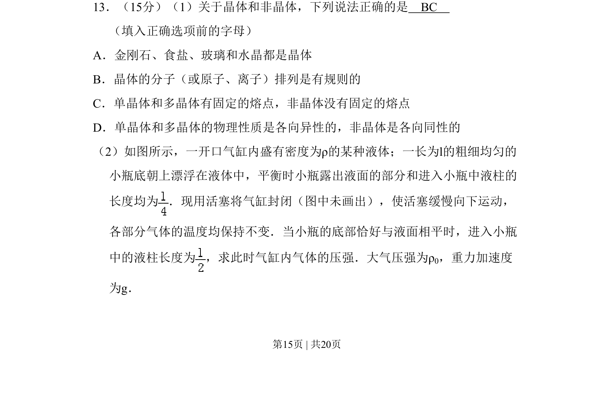
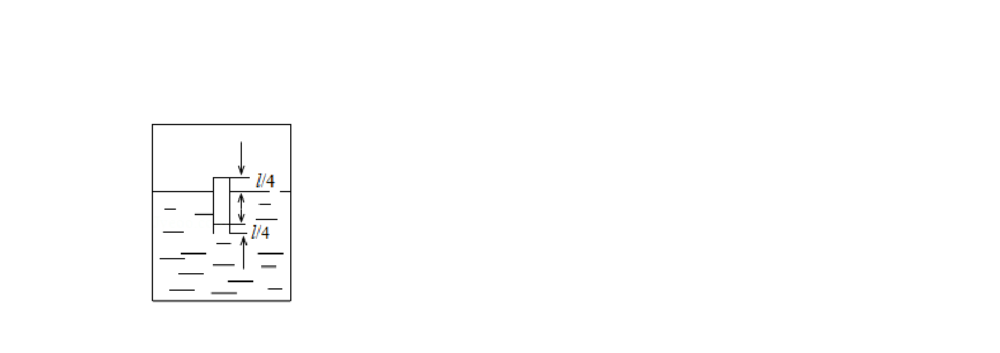
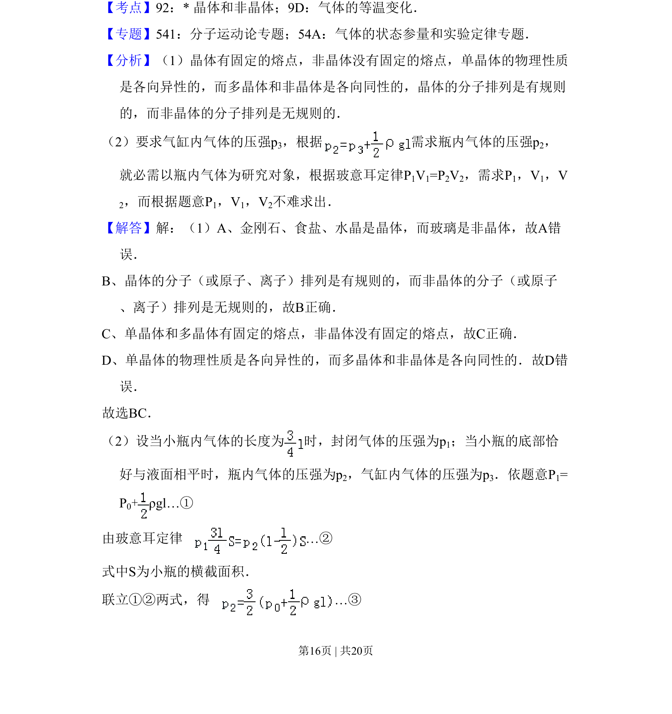
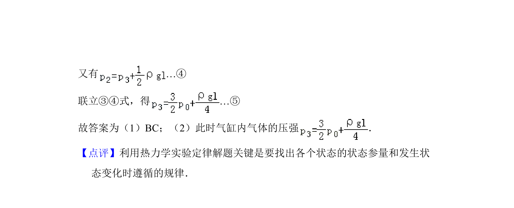

## 题面

## 摘要

一气缸内小瓶浮于液体，通过活塞压缩气体改变压强，求平衡时缸内气压。

## 关联考点

- [[444-玻意耳定律|等温变化]]
- [[549-压强平衡|压强平衡]]
- [[061-方程|方程求解]]

## 答案与解析

> 📄 原 PDF 第 15 页：`素材/真题/吉林/2008-2024·（吉林）物理高考真题/2010年高考物理试卷（新课标Ⅰ）（解析卷）.pdf`

<!-- 题干文本-start -->
## 题干文本
13．（15分）（1）关于晶体和非晶体，下列说法正确的是　BC　
（填入正确选项前的字母）
A．金刚石、食盐、玻璃和水晶都是晶体
B．晶体的分子（或原子、离子）排列是有规则的
C．单晶体和多晶体有固定的熔点，非晶体没有固定的熔点
D．单晶体和多晶体的物理性质是各向异性的，非晶体是各向同性的
（2）如图所示，一开口气缸内盛有密度为ρ的某种液体；一长为l的粗细均匀的
小瓶底朝上漂浮在液体中，平衡时小瓶露出液面的部分和进入小瓶中液柱的
长度均为 ．现用活塞将气缸封闭（图中未画出），使活塞缓慢向下运动，
各部分气体的温度均保持不变．当小瓶的底部恰好与液面相平时，进入小瓶
中的液柱长度为 ，求此时气缸内气体的压强．大气压强为ρ 0，重力加速度
为g．
<!-- 题干文本-end -->

<!-- 解析文本-start -->
## 解析文本

<!-- 解析文本-end -->
