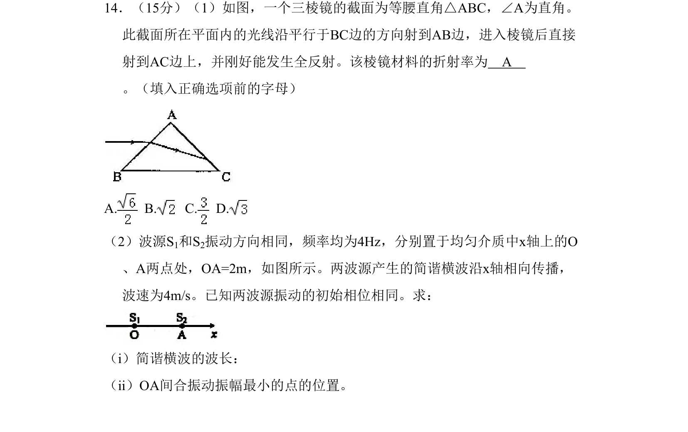
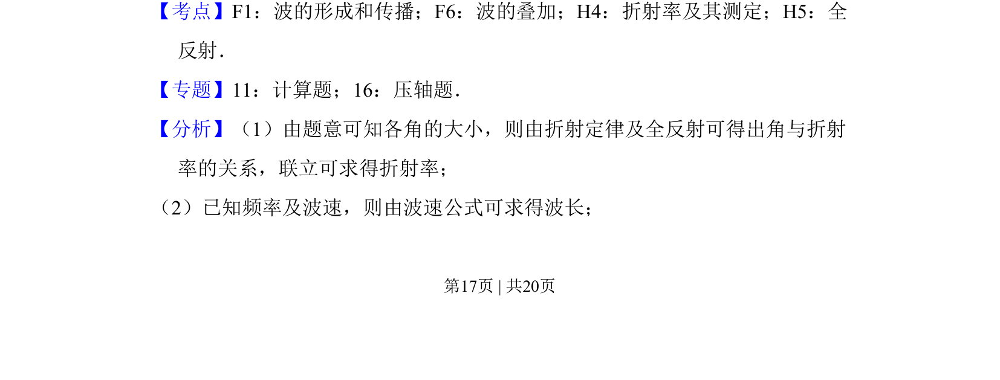
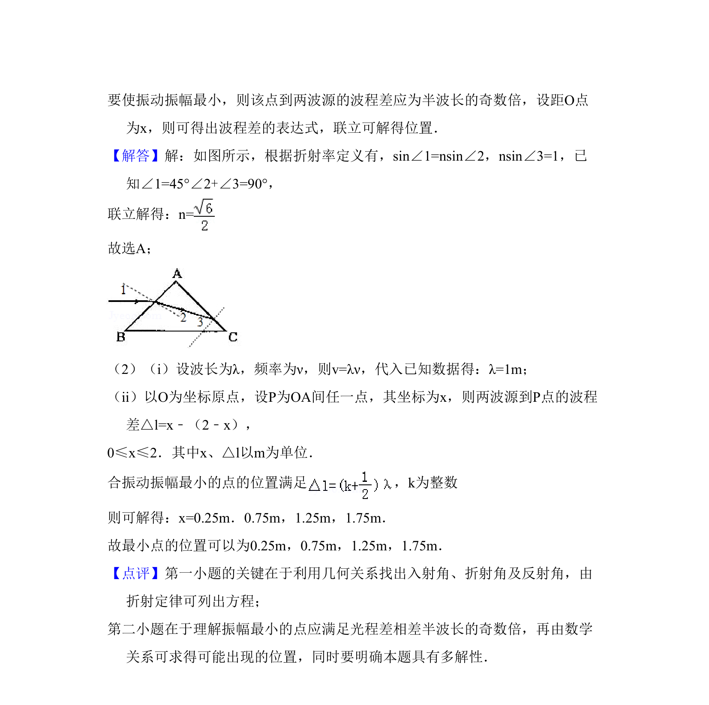

## 题面

## 摘要

通过三棱镜全反射求折射率，并结合波的叠加计算波长和振幅最小点位置

## 关联考点

- [[360-折射率|折射率]]
- [[343-全反射|全反射]]
- [[波的形成和传播]]
- [[波的叠加]]

## 答案与解析

> 📄 原 PDF 第 17 页：`素材/真题/吉林/2008-2024·（吉林）物理高考真题/2010年高考物理试卷（新课标Ⅰ）（解析卷）.pdf`
