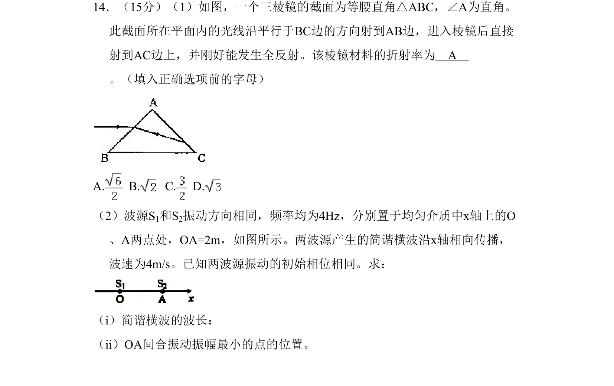
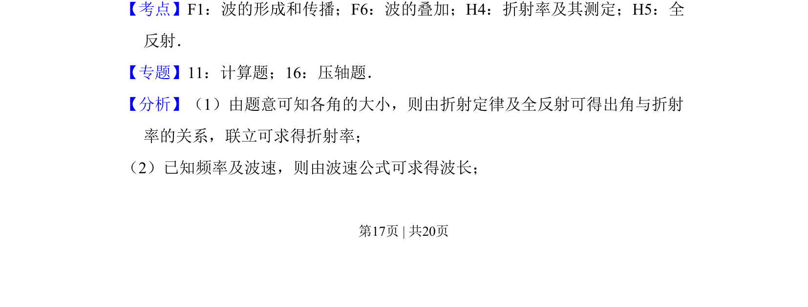
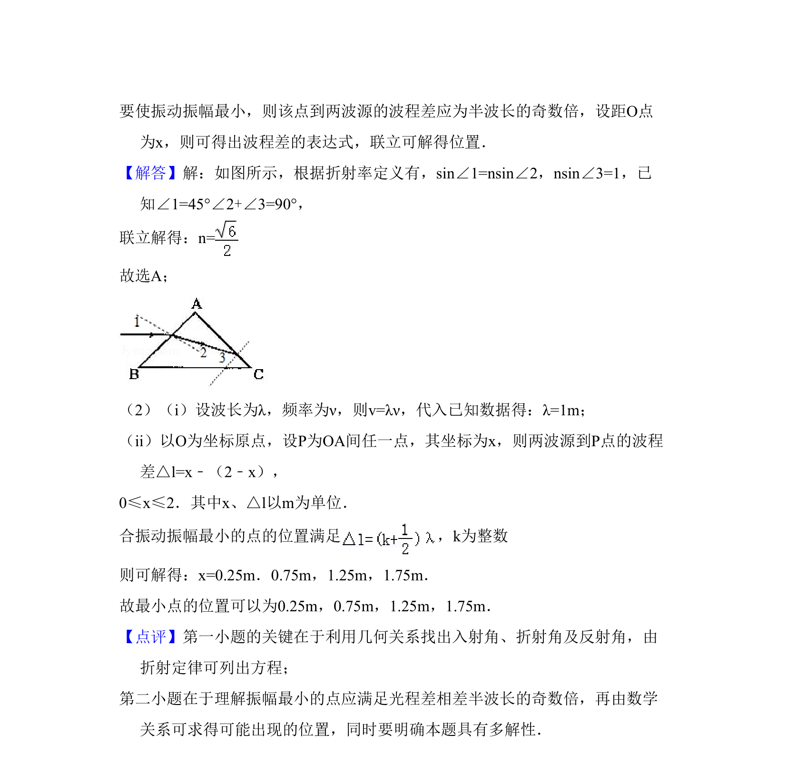

## 题面

## 摘要

通过三棱镜全反射求折射率，并结合波的叠加计算波长和振幅最小点位置

## 关联考点

- [[360-折射率|折射率]]
- [[343-全反射|全反射]]
- [[646-波的形成和传播|波的形成和传播]]
- [[645-波的叠加|波的叠加]]

## 答案与解析

> 📄 原 PDF 第 17 页：`素材/真题/吉林/2008-2024·（吉林）物理高考真题/2010年高考物理试卷（新课标Ⅰ）（解析卷）.pdf`

<!-- 题干文本-start -->
## 题干文本
14．（15分）（1）如图，一个三棱镜的截面为等腰直角△ABC，∠A为直角。
此截面所在平面内的光线沿平行于BC边的方向射到AB边，进入棱镜后直接
射到AC边上，并刚好能发生全反射。该棱镜材料的折射率为　A　
。（填入正确选项前的字母） 
A.   B.    C.   D.
（2）波源S1和S2振动方向相同，频率均为4Hz，分别置于均匀介质中x轴上的O
、A两点处，OA=2m，如图所示。两波源产生的简谐横波沿x轴相向传播，
波速为4m/s。已知两波源振动的初始相位相同。求：
（i）简谐横波的波长：
（ii）OA间合振动振幅最小的点的位置。
<!-- 题干文本-end -->

<!-- 解析文本-start -->
## 解析文本
【考点】F1：波的形成和传播；F6：波的叠加；H4：折射率及其测定；H5：全
反射．菁优网版权所有
【专题】11：计算题；16：压轴题．
【分析】（1）由题意可知各角的大小，则由折射定律及全反射可得出角与折射
率的关系，联立可求得折射率；
（2）已知频率及波速，则由波速公式可求得波长；
<!-- 解析文本-end -->
