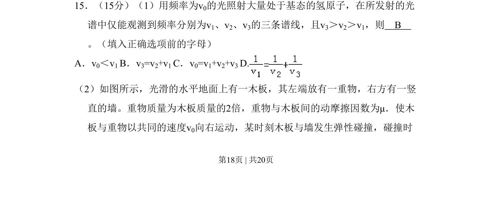
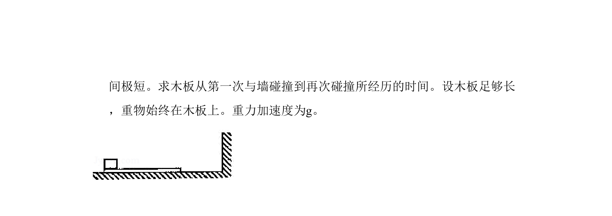
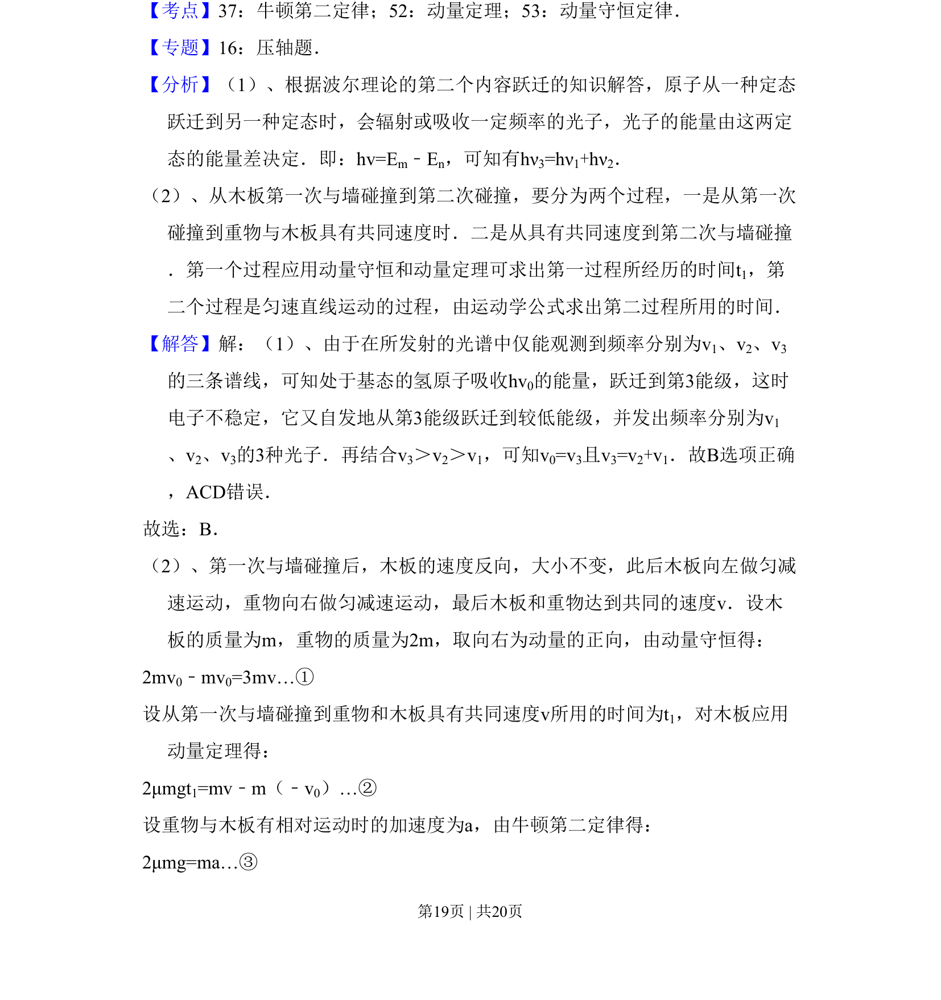
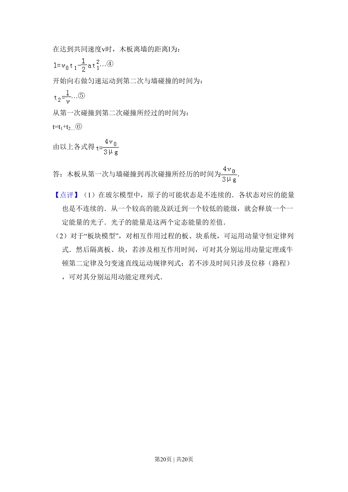

## 题面

## 摘要

本题考查氢原子能级跃迁的频率关系与木板碰撞中的动量守恒问题。

## 关联考点

- [[748-频率关系|频率关系]]
- [[359-弹性碰撞|弹性碰撞]]
- [[539-动量守恒|动量守恒]]

## 答案与解析

> 📄 原 PDF 第 18 页：`素材/真题/吉林/2008-2024·（吉林）物理高考真题/2010年高考物理试卷（新课标Ⅰ）（解析卷）.pdf`

<!-- 题干文本-start -->
## 题干文本
15．（15分）（1）用频率为v0的光照射大量处于基态的氢原子，在所发射的光
谱中仅能观测到频率分别为v1、v2、v3的三条谱线，且v3＞v2＞v1，则　B　
。（填入正确选项前的字母）
A．v0＜v1 B．v3=v2+v1 C．v0=v1+v2+v3 D.
（2）如图所示，光滑的水平地面上有一木板，其左端放有一重物，右方有一竖
直的墙。重物质量为木板质量的2倍，重物与木板间的动摩擦因数为μ．使木
板与重物以共同的速度v0向右运动，某时刻木板与墙发生弹性碰撞，碰撞时
<!-- 题干文本-end -->

<!-- 解析文本-start -->
## 解析文本

<!-- 解析文本-end -->
