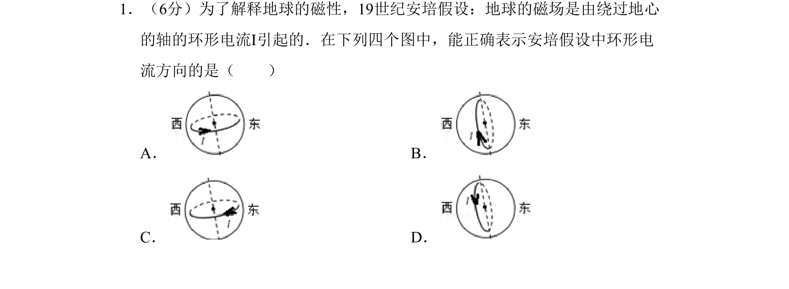
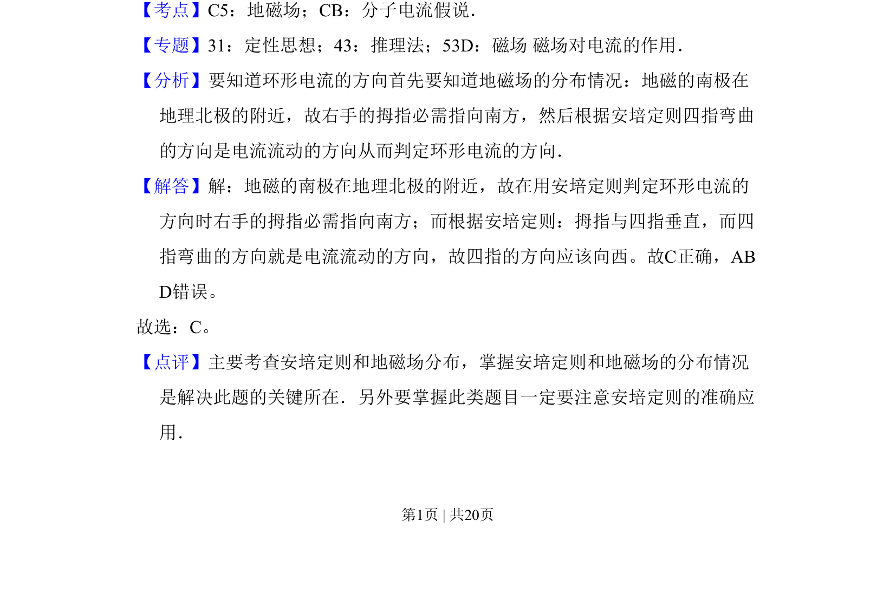

## 题面

## 摘要

考查安培定则及地磁场分布，判断环形电流方向。

## 关联考点

- [[132-地磁场|地磁场]]
- [[457-分子电流假说|分子电流假说]]
- [[135-安培定则|安培定则]]

## 答案与解析

> 📄 原 PDF 第 1 页：`素材/真题/吉林/2008-2024·（吉林）物理高考真题/2011年高考物理试卷（新课标）（解析卷）.pdf`

<!-- 题干文本-start -->
## 题干文本
1．（6分）为了解释地球的磁性，19世纪安培假设：地球的磁场是由绕过地心
的轴的环形电流I引起的．在下列四个图中，能正确表示安培假设中环形电
流方向的是（　　）
A．B．
C．D．
<!-- 题干文本-end -->

<!-- 解析文本-start -->
## 解析文本
【考点】C5：地磁场；CB：分子电流假说．菁优网版权所有
【专题】31：定性思想；43：推理法；53D：磁场 磁场对电流的作用．
【分析】要知道环形电流的方向首先要知道地磁场的分布情况：地磁的南极在
地理北极的附近，故右手的拇指必需指向南方，然后根据安培定则四指弯曲
的方向是电流流动的方向从而判定环形电流的方向．
【解答】解：地磁的南极在地理北极的附近，故在用安培定则判定环形电流的
方向时右手的拇指必需指向南方；而根据安培定则：拇指与四指垂直，而四
指弯曲的方向就是电流流动的方向，故四指的方向应该向西。故C正确，AB
D错误。
故选：C。
【点评】主要考查安培定则和地磁场分布，掌握安培定则和地磁场的分布情况
是解决此题的关键所在．另外要掌握此类题目一定要注意安培定则的准确应
用．
<!-- 解析文本-end -->
