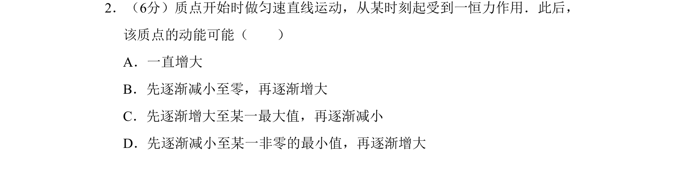
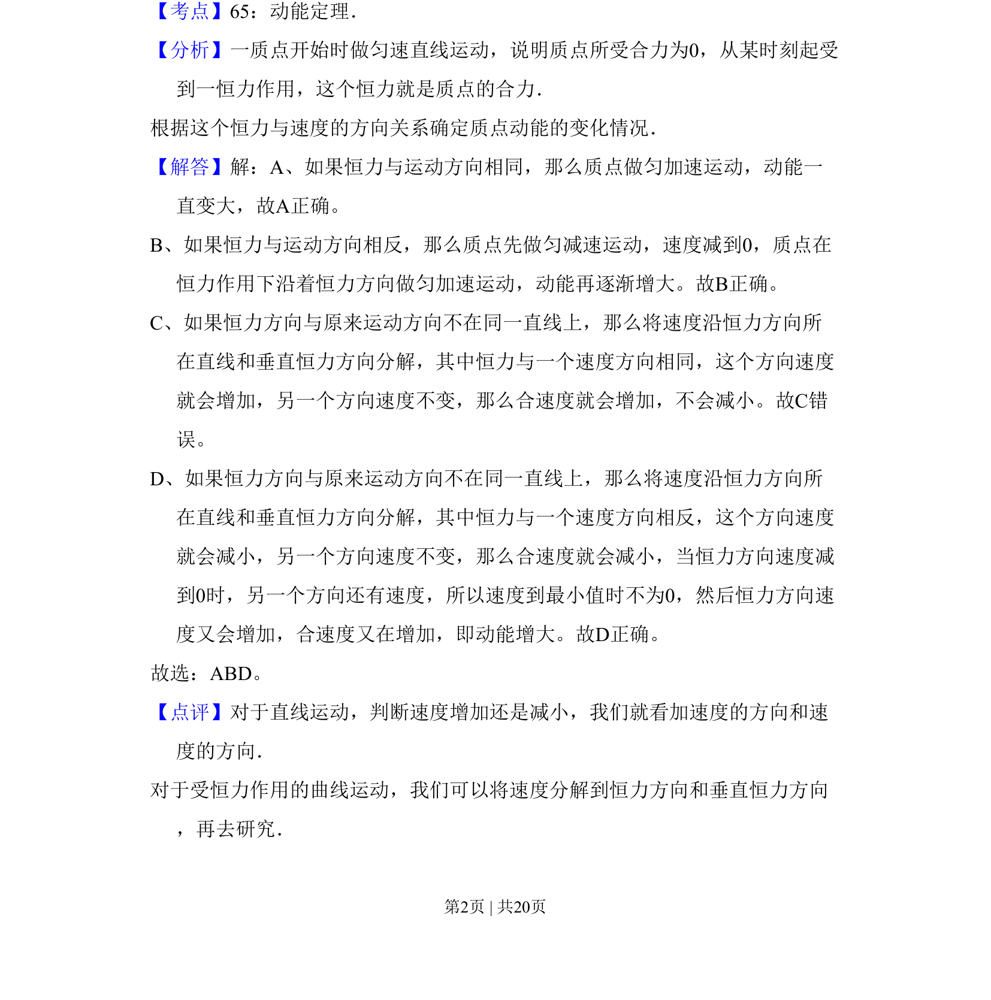

## 题面

## 摘要

该题考查恒力作用下质点动能的变化，需根据力与速度的方向关系分析不同运动情况。

## 关联考点

- [[251-动能定理|动能定理]]
- [[611-恒力|恒力]]
- [[780-速度分解|速度分解]]
- [[271-曲线运动|曲线运动]]

## 答案与解析

> 📄 原 PDF 第 2 页：`素材/真题/吉林/2008-2024·（吉林）物理高考真题/2011年高考物理试卷（新课标）（解析卷）.pdf`
