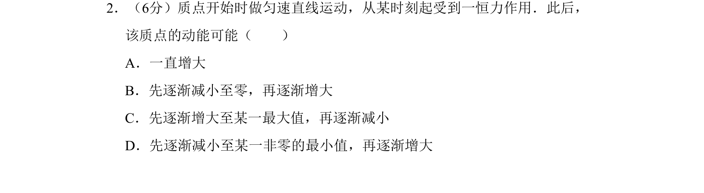
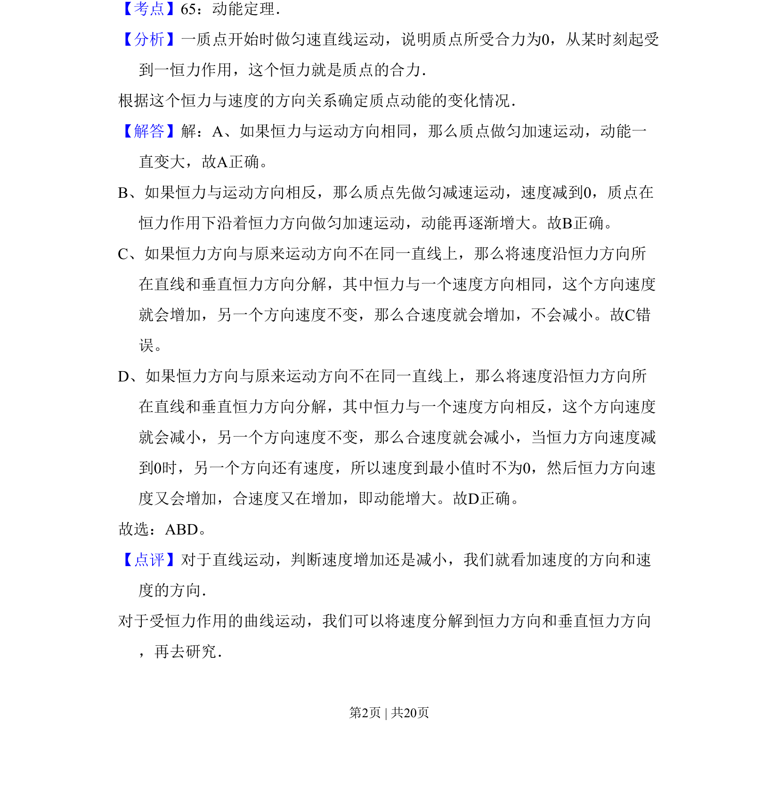

## 题面

## 摘要

该题考查恒力作用下质点动能的变化，需根据力与速度的方向关系分析不同运动情况。

## 关联考点

- [[251-动能定理|动能定理]]
- [[611-恒力|恒力]]
- [[780-速度分解|速度分解]]
- [[271-曲线运动|曲线运动]]

## 答案与解析

> 📄 原 PDF 第 2 页：`素材/真题/吉林/2008-2024·（吉林）物理高考真题/2011年高考物理试卷（新课标）（解析卷）.pdf`

<!-- 题干文本-start -->
## 题干文本
2．（6分）质点开始时做匀速直线运动，从某时刻起受到一恒力作用．此后，
该质点的动能可能（　　）
A．一直增大
B．先逐渐减小至零，再逐渐增大
C．先逐渐增大至某一最大值，再逐渐减小
D．先逐渐减小至某一非零的最小值，再逐渐增大
<!-- 题干文本-end -->

<!-- 解析文本-start -->
## 解析文本
【考点】65：动能定理．菁优网版权所有
【分析】一质点开始时做匀速直线运动，说明质点所受合力为0，从某时刻起受
到一恒力作用，这个恒力就是质点的合力．
根据这个恒力与速度的方向关系确定质点动能的变化情况．
【解答】解：A、如果恒力与运动方向相同，那么质点做匀加速运动，动能一
直变大，故A正确。
B、如果恒力与运动方向相反，那么质点先做匀减速运动，速度减到0，质点在
恒力作用下沿着恒力方向做匀加速运动，动能再逐渐增大。故B正确。
C、如果恒力方向与原来运动方向不在同一直线上，那么将速度沿恒力方向所
在直线和垂直恒力方向分解，其中恒力与一个速度方向相同，这个方向速度
就会增加，另一个方向速度不变，那么合速度就会增加，不会减小。故C错
误。
D、如果恒力方向与原来运动方向不在同一直线上，那么将速度沿恒力方向所
在直线和垂直恒力方向分解，其中恒力与一个速度方向相反，这个方向速度
就会减小，另一个方向速度不变，那么合速度就会减小，当恒力方向速度减
到0时，另一个方向还有速度，所以速度到最小值时不为0，然后恒力方向速
度又会增加，合速度又在增加，即动能增大。故D正确。
故选：ABD。
【点评】对于直线运动，判断速度增加还是减小，我们就看加速度的方向和速
度的方向．
对于受恒力作用的曲线运动，我们可以将速度分解到恒力方向和垂直恒力方向
，再去研究．
<!-- 解析文本-end -->
