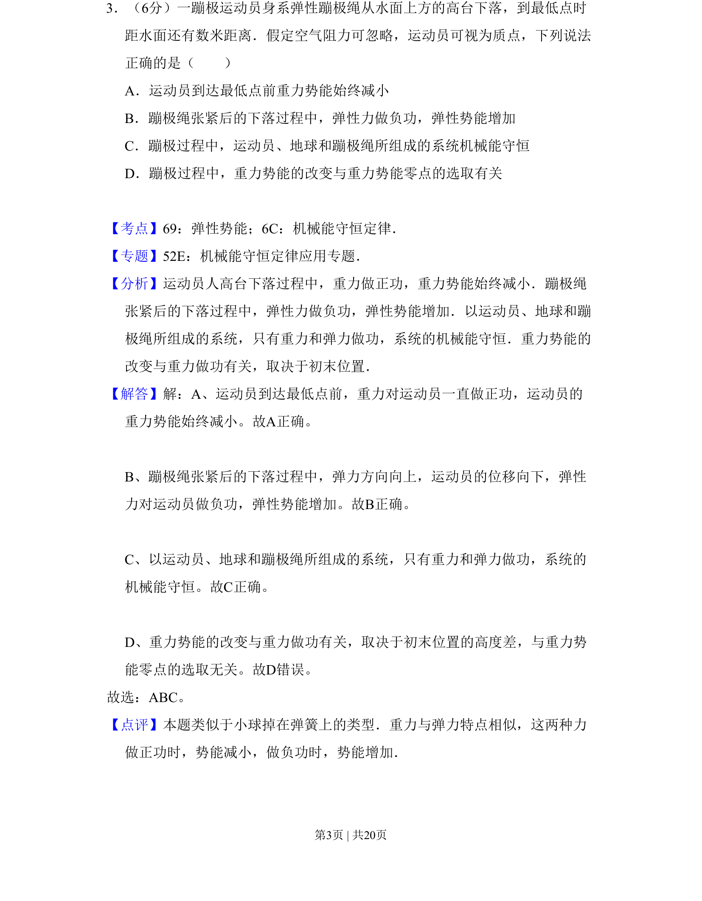
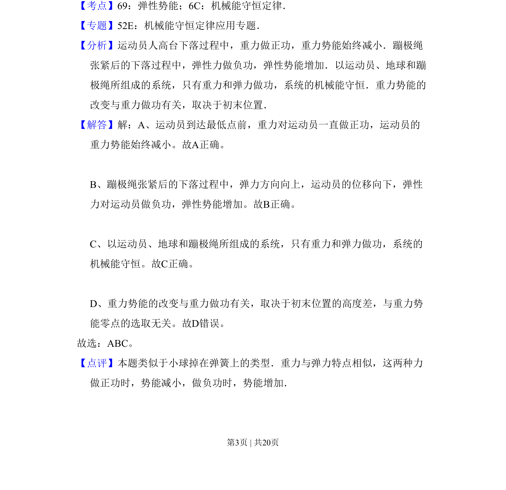

## 题面

## 摘要

蹦极过程中重力势能、弹性势能与机械能守恒的判断

## 关联考点

- [[079-弹性势能|弹性势能]]
- [[085-机械能守恒-初中|机械能守恒定律]]

## 答案与解析

> 📄 原 PDF 第 3 页：`素材/真题/吉林/2008-2024·（吉林）物理高考真题/2011年高考物理试卷（新课标）（解析卷）.pdf`

<!-- 题干文本-start -->
## 题干文本
3．（6分）一蹦极运动员身系弹性蹦极绳从水面上方的高台下落，到最低点时
距水面还有数米距离．假定空气阻力可忽略，运动员可视为质点，下列说法
正确的是（　　）
A．运动员到达最低点前重力势能始终减小
B．蹦极绳张紧后的下落过程中，弹性力做负功，弹性势能增加
C．蹦极过程中，运动员、地球和蹦极绳所组成的系统机械能守恒
D．蹦极过程中，重力势能的改变与重力势能零点的选取有关
<!-- 题干文本-end -->

<!-- 解析文本-start -->
## 解析文本
【考点】69：弹性势能；6C：机械能守恒定律．菁优网版权所有
【专题】52E：机械能守恒定律应用专题．
【分析】运动员人高台下落过程中，重力做正功，重力势能始终减小．蹦极绳
张紧后的下落过程中，弹性力做负功，弹性势能增加．以运动员、地球和蹦
极绳所组成的系统，只有重力和弹力做功，系统的机械能守恒．重力势能的
改变与重力做功有关，取决于初末位置．
【解答】解：A、运动员到达最低点前，重力对运动员一直做正功，运动员的
重力势能始终减小。故A正确。
    
B、蹦极绳张紧后的下落过程中，弹力方向向上，运动员的位移向下，弹性
力对运动员做负功，弹性势能增加。故B正确。
    
C、以运动员、地球和蹦极绳所组成的系统，只有重力和弹力做功，系统的
机械能守恒。故C正确。
    
D、重力势能的改变与重力做功有关，取决于初末位置的高度差，与重力势
能零点的选取无关。故D错误。
故选：ABC。
【点评】本题类似于小球掉在弹簧上的类型．重力与弹力特点相似，这两种力
做正功时，势能减小，做负功时，势能增加．
<!-- 解析文本-end -->
