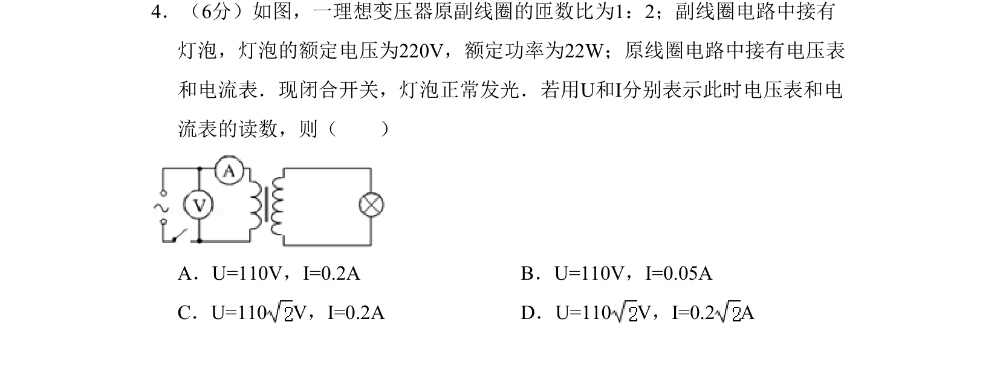

## 题面

## 摘要

该题通过理想变压器灯泡正常发光条件，考查原副线圈电压、电流与匝数的关系及电功率计算。

## 关联考点

- [[变压器构造和原理]]
- [[电压与匝数成正比]]
- [[电流与匝数成反比]]
- [[电功率计算]]

## 答案与解析

> 📄 原 PDF 第 4 页：`素材/真题/吉林/2008-2024·（吉林）物理高考真题/2011年高考物理试卷（新课标）（解析卷）.pdf`
