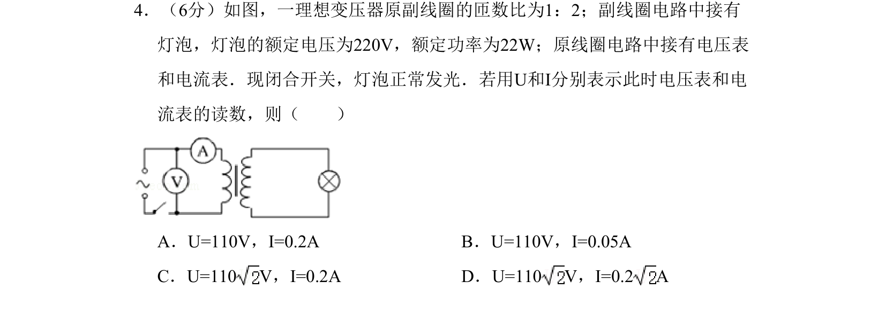
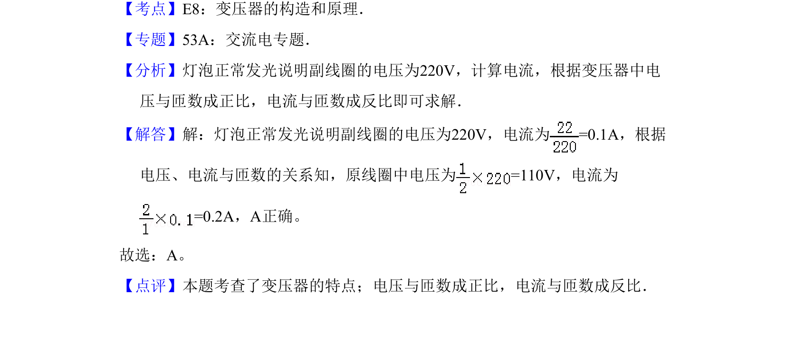

## 题面

## 摘要

该题通过理想变压器灯泡正常发光条件，考查原副线圈电压、电流与匝数的关系及电功率计算。

## 关联考点

- [[557-变压器的构造和原理|变压器构造和原理]]
- [[485-电压与匝数成正比|电压与匝数成正比]]
- [[680-电流与匝数成反比|电流与匝数成反比]]
- [[666-电功率计算|电功率计算]]

## 答案与解析

> 📄 原 PDF 第 4 页：`素材/真题/吉林/2008-2024·（吉林）物理高考真题/2011年高考物理试卷（新课标）（解析卷）.pdf`

<!-- 题干文本-start -->
## 题干文本
4．（6分）如图，一理想变压器原副线圈的匝数比为1：2；副线圈电路中接有
灯泡，灯泡的额定电压为220V，额定功率为22W；原线圈电路中接有电压表
和电流表．现闭合开关，灯泡正常发光．若用U和I分别表示此时电压表和电
流表的读数，则（　　）
A．U=110V，I=0.2A B．U=110V，I=0.05A
C．U=110 V，I=0.2A D．U=110 V，I=0.2 A
<!-- 题干文本-end -->

<!-- 解析文本-start -->
## 解析文本
【考点】E8：变压器的构造和原理．菁优网版权所有
【专题】53A：交流电专题．
【分析】灯泡正常发光说明副线圈的电压为220V，计算电流，根据变压器中电
压与匝数成正比，电流与匝数成反比即可求解．
【解答】解：灯泡正常发光说明副线圈的电压为220V，电流为=0.1A，根据
电压、电流与匝数的关系知，原线圈中电压为=110V，电流为
=0.2A，A正确。
故选：A。
【点评】本题考查了变压器的特点；电压与匝数成正比，电流与匝数成反比．
<!-- 解析文本-end -->
