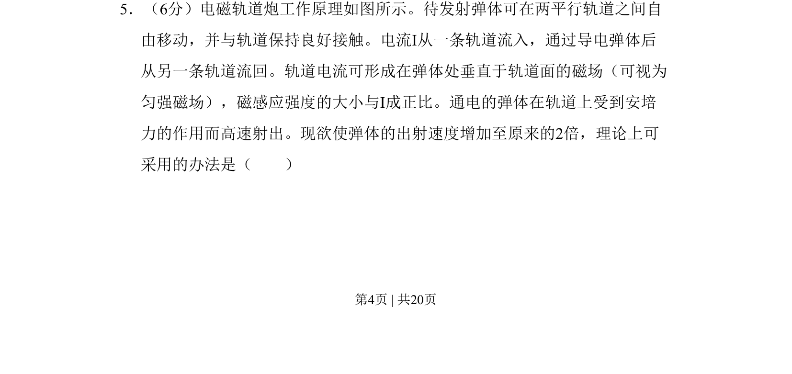
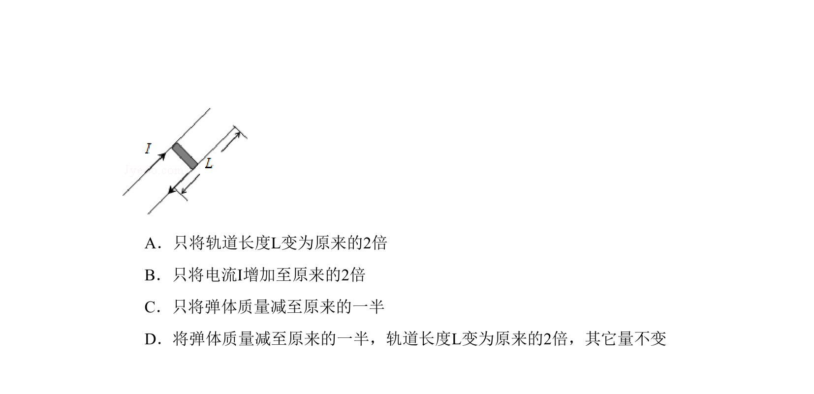
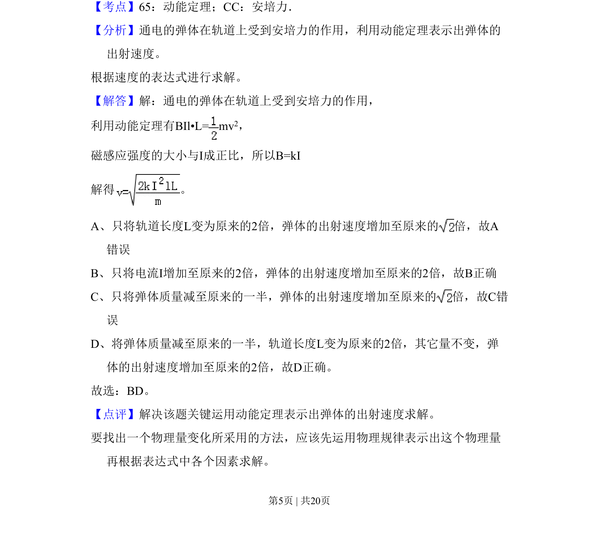

## 题面

## 摘要

该题考查安培力作用下弹体的加速问题，涉及动能定理与磁感应强度等物理量的关系。

## 关联考点

- [[188-磁场对通电导体的作用|安培力]]
- [[251-动能定理|动能定理]]
- [[292-匀强磁场|匀强磁场]]
- [[323-磁感应强度|磁感应强度]]

## 答案与解析

> 📄 原 PDF 第 4 页：`素材/真题/吉林/2008-2024·（吉林）物理高考真题/2011年高考物理试卷（新课标）（解析卷）.pdf`
