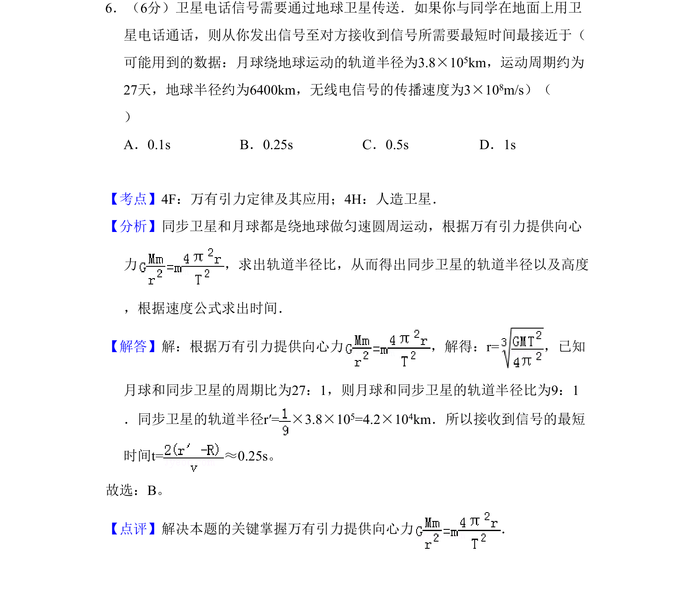
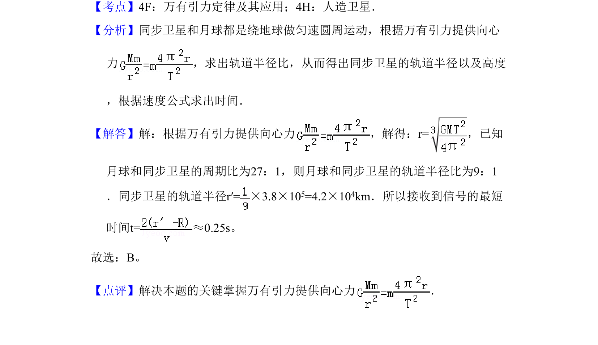

## 题面

## 摘要

本题利用万有引力定律求同步卫星轨道半径，进而计算信号传播最短时间。

## 关联考点

- [[246-万有引力定律|万有引力定律]]
- [[560-同步卫星|同步卫星]]
- [[562-周期与轨道半径关系|周期与轨道半径关系]]

## 答案与解析

> 📄 原 PDF 第 6 页：`素材/真题/吉林/2008-2024·（吉林）物理高考真题/2011年高考物理试卷（新课标）（解析卷）.pdf`

<!-- 题干文本-start -->
## 题干文本
6．（6分）卫星电话信号需要通过地球卫星传送．如果你与同学在地面上用卫
星电话通话，则从你发出信号至对方接收到信号所需要最短时间最接近于（
可能用到的数据：月球绕地球运动的轨道半径为3.8×105km，运动周期约为
27天，地球半径约为6400km，无线电信号的传播速度为3×108m/s）（　　
）
A．0.1s B．0.25s C．0.5s D．1s
<!-- 题干文本-end -->

<!-- 解析文本-start -->
## 解析文本
【考点】4F：万有引力定律及其应用；4H：人造卫星．菁优网版权所有
【分析】同步卫星和月球都是绕地球做匀速圆周运动，根据万有引力提供向心
力 ，求出轨道半径比，从而得出同步卫星的轨道半径以及高度
，根据速度公式求出时间．
【解答】解：根据万有引力提供向心力 ，解得：r=，已知
月球和同步卫星的周期比为27：1，则月球和同步卫星的轨道半径比为9：1
．同步卫星的轨道半径r′=×3.8×10 5=4.2×104km．所以接收到信号的最短
时间t=≈0.25s。
故选：B。
【点评】解决本题的关键掌握万有引力提供向心力 ．
<!-- 解析文本-end -->
