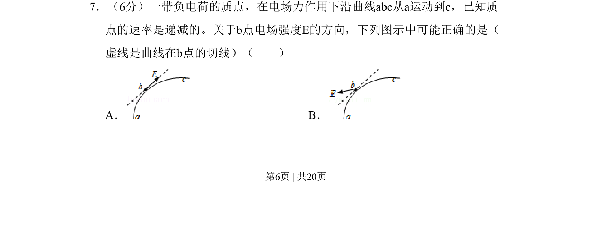

## 题面

## 摘要

一带负电质点沿曲线减速运动，根据速率递减和轨迹弯曲方向判断电场强度方向。

## 关联考点

- [[271-曲线运动|曲线运动]]
- [[切线方向]]
- [[加速度分析]]
- [[力与运动关系]]

## 答案与解析

> 📄 原 PDF 第 6 页：`素材/真题/吉林/2008-2024·（吉林）物理高考真题/2011年高考物理试卷（新课标）（解析卷）.pdf`
