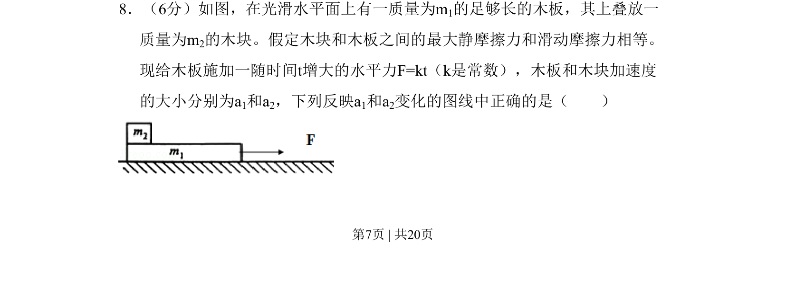

## 题面

## 摘要

木块叠放于木板上，在随时间线性增大的外力作用下，分析两物体加速度随外力变化的图像。

## 关联考点

- [[097-滑动摩擦力|滑动摩擦力]]
- [[120-静摩擦力-初中|静摩擦力]]
- [[229-牛顿第二定律|牛顿第二定律]]
- [[临界状态]]

## 答案与解析

> 📄 原 PDF 第 7 页：`素材/真题/吉林/2008-2024·（吉林）物理高考真题/2011年高考物理试卷（新课标）（解析卷）.pdf`
