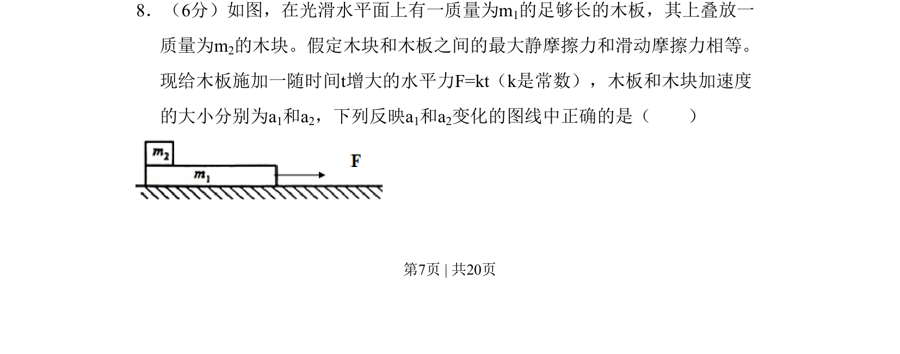
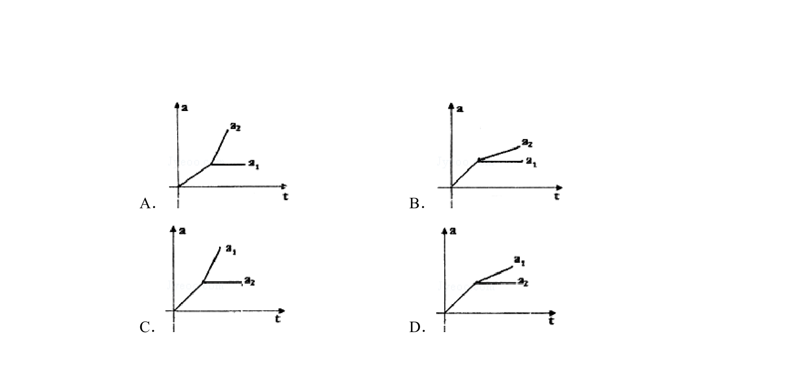
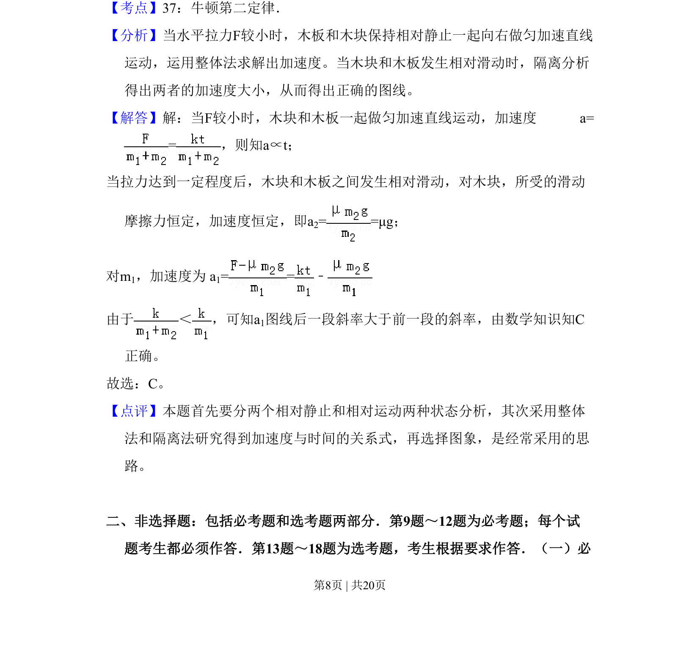

## 题面

## 摘要

木块叠放于木板上，在随时间线性增大的外力作用下，分析两物体加速度随外力变化的图像。

## 关联考点

- [[097-滑动摩擦力|滑动摩擦力]]
- [[120-静摩擦力-初中|静摩擦力]]
- [[229-牛顿第二定律|牛顿第二定律]]
- [[506-临界条件|临界状态]]

## 答案与解析

> 📄 原 PDF 第 7 页：`素材/真题/吉林/2008-2024·（吉林）物理高考真题/2011年高考物理试卷（新课标）（解析卷）.pdf`

<!-- 题干文本-start -->
## 题干文本
8．（6分）如图，在光滑水平面上有一质量为m1的足够长的木板，其上叠放一
质量为m2的木块。假定木块和木板之间的最大静摩擦力和滑动摩擦力相等。
现给木板施加一随时间t增大的水平力F=kt（k是常数），木板和木块加速度
的大小分别为a1和a2，下列反映a1和a2变化的图线中正确的是（　　）
<!-- 题干文本-end -->

<!-- 解析文本-start -->
## 解析文本

<!-- 解析文本-end -->
