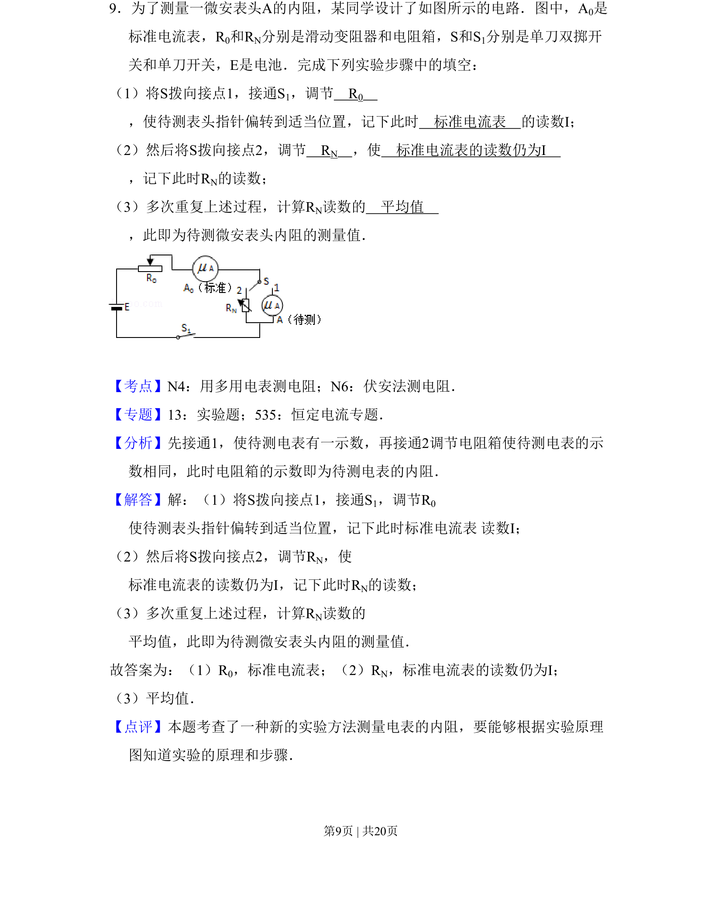
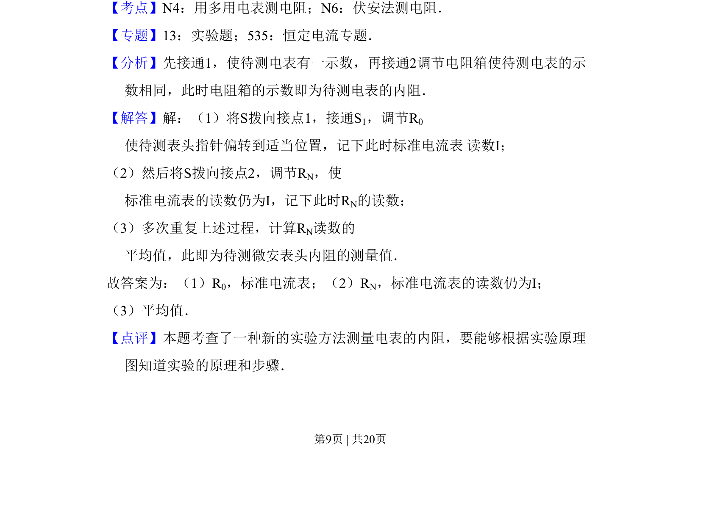

## 题面

## 摘要

利用等效替代法测量微安表内阻的实验步骤和原理

## 关联考点

- [[709-等效替代法|等效替代法]]
- [[772-电阻测量|电阻测量]]
- [[691-电表读数|电表读数]]

## 答案与解析

> 📄 原 PDF 第 9 页：`素材/真题/吉林/2008-2024·（吉林）物理高考真题/2011年高考物理试卷（新课标）（解析卷）.pdf`

<!-- 题干文本-start -->
## 题干文本
9．为了测量一微安表头A的内阻，某同学设计了如图所示的电路．图中，A0是
标准电流表，R0和RN分别是滑动变阻器和电阻箱，S和S1分别是单刀双掷开
关和单刀开关，E是电池．完成下列实验步骤中的填空：
（1）将S拨向接点1，接通S1，调节　R0　
，使待测表头指针偏转到适当位置，记下此时　标准电流表　的读数I；
（2）然后将S拨向接点2，调节　RN　，使　标准电流表的读数仍为I　
，记下此时RN的读数；
（3）多次重复上述过程，计算RN读数的　平均值　
，此即为待测微安表头内阻的测量值．
<!-- 题干文本-end -->

<!-- 解析文本-start -->
## 解析文本
【考点】N4：用多用电表测电阻；N6：伏安法测电阻．菁优网版权所有
【专题】13：实验题；535：恒定电流专题．
【分析】先接通1，使待测电表有一示数，再接通2调节电阻箱使待测电表的示
数相同，此时电阻箱的示数即为待测电表的内阻．
【解答】解：（1）将S拨向接点1，接通S1，调节R0 
使待测表头指针偏转到适当位置，记下此时标准电流表 读数I；
（2）然后将S拨向接点2，调节RN，使 
标准电流表的读数仍为I，记下此时RN的读数；
（3）多次重复上述过程，计算RN读数的 
平均值，此即为待测微安表头内阻的测量值．
故答案为：（1）R0，标准电流表；（2）RN，标准电流表的读数仍为I；
（3）平均值．
【点评】本题考查了一种新的实验方法测量电表的内阻，要能够根据实验原理
图知道实验的原理和步骤．
<!-- 解析文本-end -->
