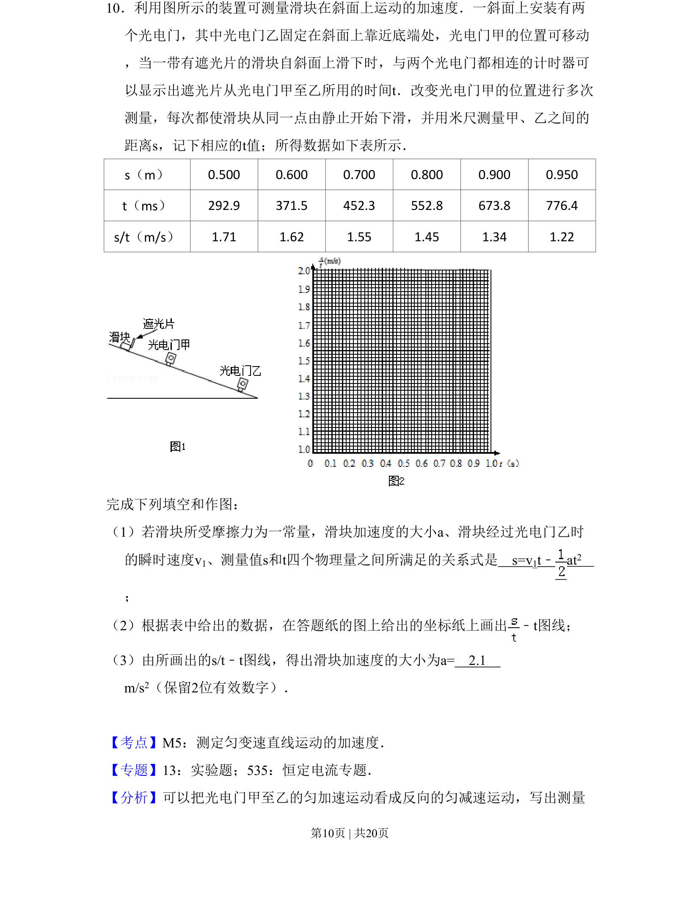
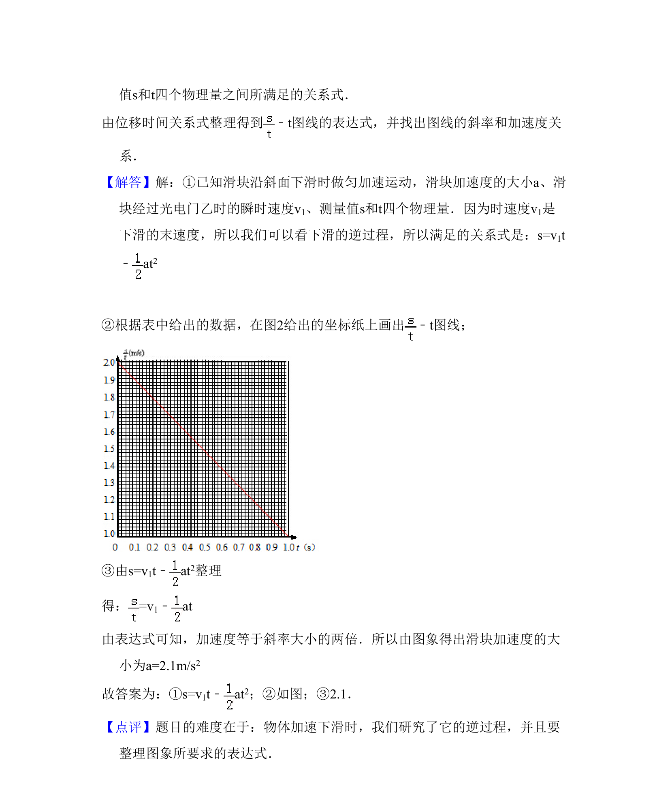

## 题面

## 摘要

通过光电门测量数据，利用匀变速运动公式和图像法求滑块加速度的实验题

## 关联考点

- [[650-测定匀变速直线运动的加速度|测定匀变速直线运动的加速度]]
- [[566-图像法处理实验数据|图像法处理实验数据]]
- [[545-匀变速运动位移时间关系|匀变速运动位移时间关系]]

## 答案与解析

> 📄 原 PDF 第 10 页：`素材/真题/吉林/2008-2024·（吉林）物理高考真题/2011年高考物理试卷（新课标）（解析卷）.pdf`
