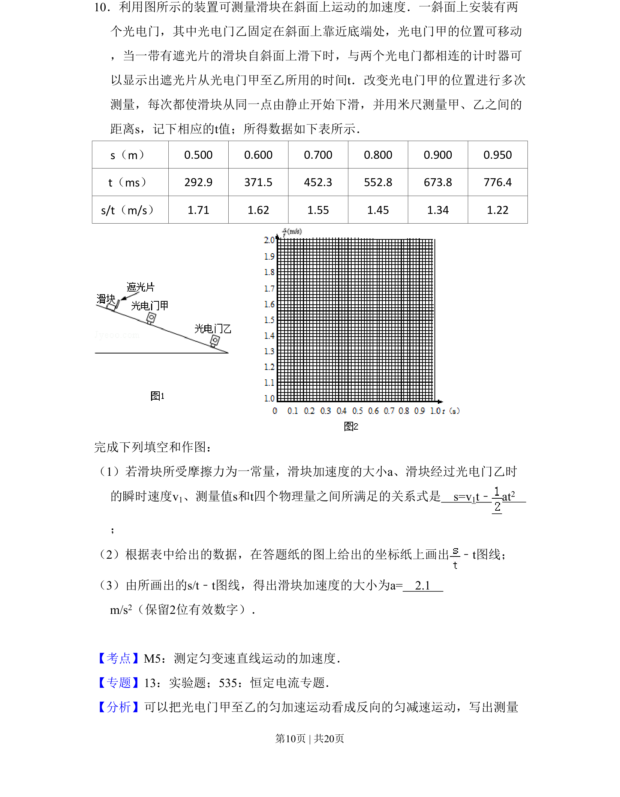
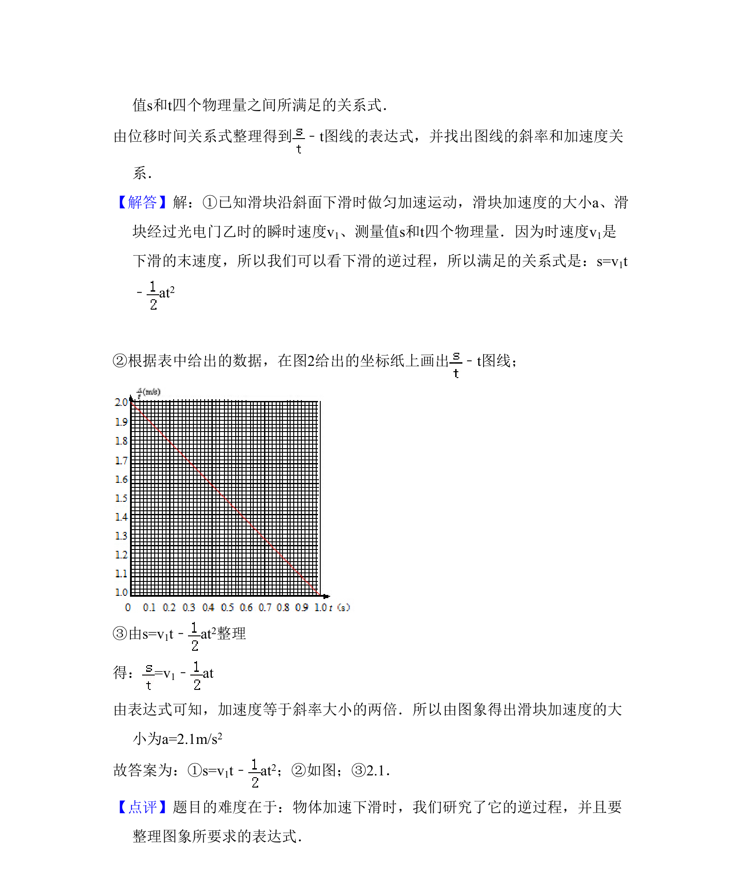

## 题面

## 摘要

通过光电门测量数据，利用匀变速运动公式和图像法求滑块加速度的实验题

## 关联考点

- [[650-测定匀变速直线运动的加速度|测定匀变速直线运动的加速度]]
- [[566-图像法处理实验数据|图像法处理实验数据]]
- [[545-匀变速运动位移时间关系|匀变速运动位移时间关系]]

## 答案与解析

> 📄 原 PDF 第 10 页：`素材/真题/吉林/2008-2024·（吉林）物理高考真题/2011年高考物理试卷（新课标）（解析卷）.pdf`

<!-- 题干文本-start -->
## 题干文本
10．利用图所示的装置可测量滑块在斜面上运动的加速度．一斜面上安装有两
个光电门，其中光电门乙固定在斜面上靠近底端处，光电门甲的位置可移动
，当一带有遮光片的滑块自斜面上滑下时，与两个光电门都相连的计时器可
以显示出遮光片从光电门甲至乙所用的时间t．改变光电门甲的位置进行多次
测量，每次都使滑块从同一点由静止开始下滑，并用米尺测量甲、乙之间的
距离s，记下相应的t值；所得数据如下表所示．
s（m） 0.500 0.600 0.700 0.800 0.900 0.950
t（ms） 292.9 371.5 452.3 552.8 673.8 776.4
s/t（m/s） 1.71 1.62 1.55 1.45 1.34 1.22
完成下列填空和作图：
（1）若滑块所受摩擦力为一常量，滑块加速度的大小a、滑块经过光电门乙时
的瞬时速度v1、测量值s和t四个物理量之间所满足的关系式是　s=v1t﹣ at2　
；
（2）根据表中给出的数据，在答题纸的图上给出的坐标纸上画出 ﹣t图线；
（3）由所画出的s/t﹣t图线，得出滑块加速度的大小为a=　2.1　
m/s2（保留2位有效数字）．
<!-- 题干文本-end -->

<!-- 解析文本-start -->
## 解析文本
【考点】M5：测定匀变速直线运动的加速度．菁优网版权所有
【专题】13：实验题；535：恒定电流专题．
【分析】可以把光电门甲至乙的匀加速运动看成反向的匀减速运动，写出测量
<!-- 解析文本-end -->
