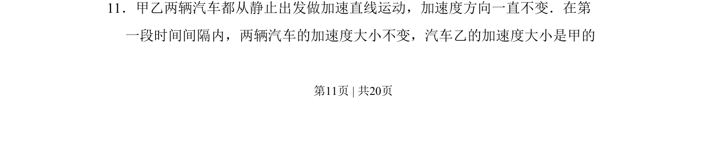
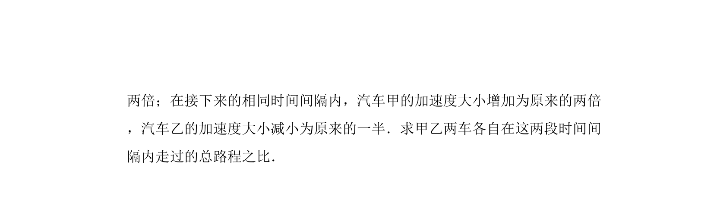
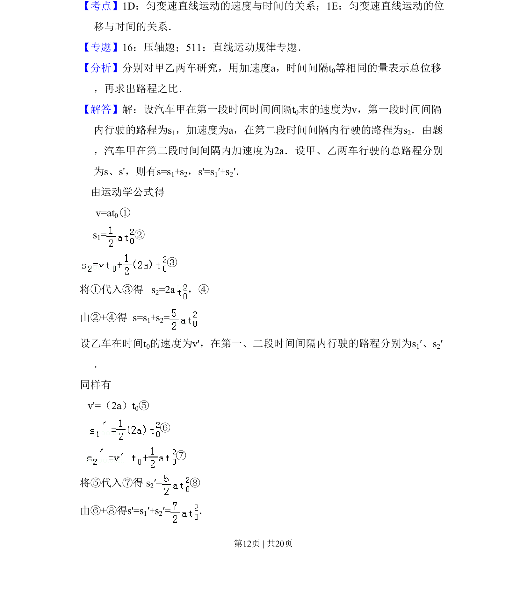
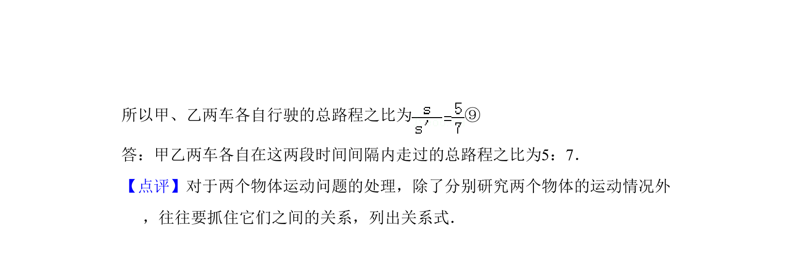

## 题面

## 摘要

甲乙两车从静止开始做不同加速度的匀加速直线运动，比较运动过程中的位移或速度关系。

## 关联考点

- [[215-匀变速直线运动|匀变速直线运动]]
- [[214-加速度|加速度]]
- [[206-位移公式-匀变速|位移公式]]

## 答案与解析

> 📄 原 PDF 第 11 页：`素材/真题/吉林/2008-2024·（吉林）物理高考真题/2011年高考物理试卷（新课标）（解析卷）.pdf`
