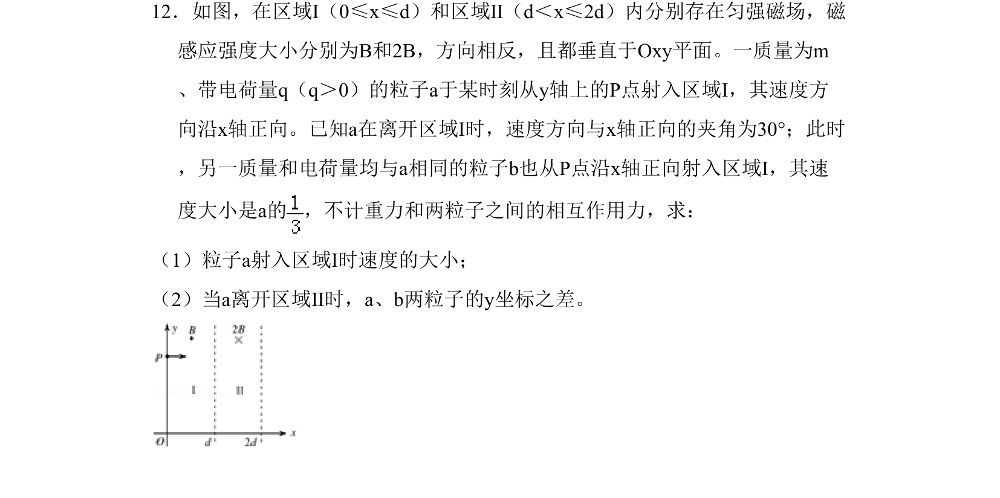
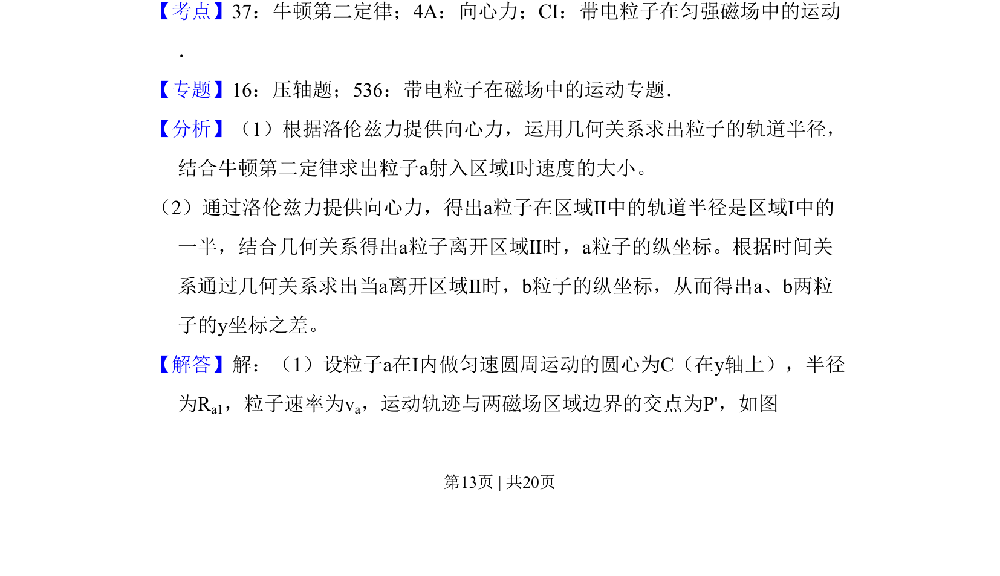
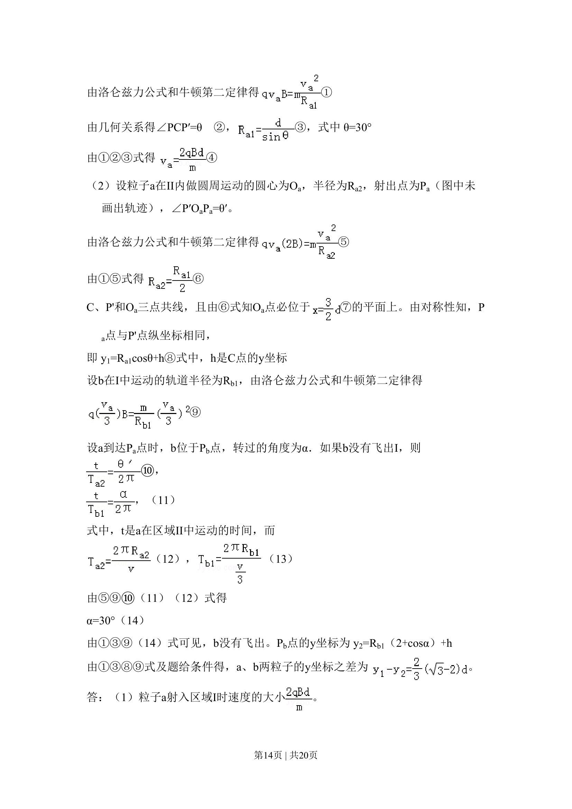
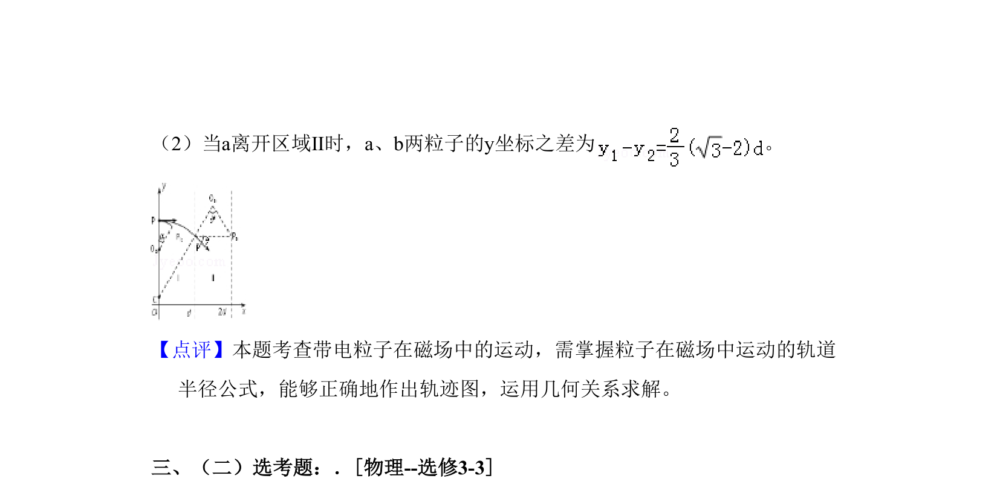

## 题面

## 摘要

带电粒子在两相邻反向匀强磁场中的偏转问题，涉及求入射速度及两粒子坐标差。

## 关联考点

- [[229-牛顿第二定律|牛顿第二定律]]
- [[256-向心力|向心力]]
- [[带电粒子在匀强磁场中的运动]]

## 答案与解析

> 📄 原 PDF 第 13 页：`素材/真题/吉林/2008-2024·（吉林）物理高考真题/2011年高考物理试卷（新课标）（解析卷）.pdf`
