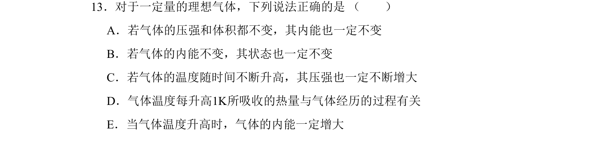
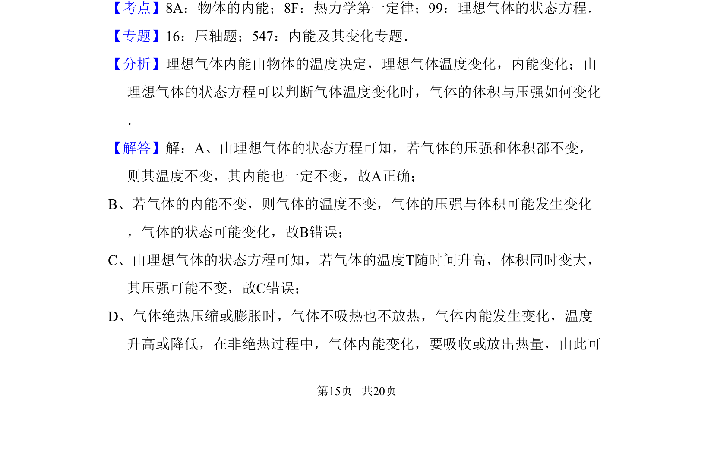
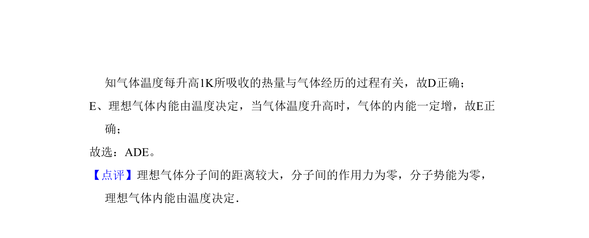

## 题面

## 摘要

考查理想气体状态方程、内能与热力学第一定律的综合判断。

## 关联考点

- [[483-理想气体的状态方程|理想气体的状态方程]]
- [[440-热力学第一定律|热力学第一定律]]
- [[127-内能|内能]]

## 答案与解析

> 📄 原 PDF 第 15 页：`素材/真题/吉林/2008-2024·（吉林）物理高考真题/2011年高考物理试卷（新课标）（解析卷）.pdf`
