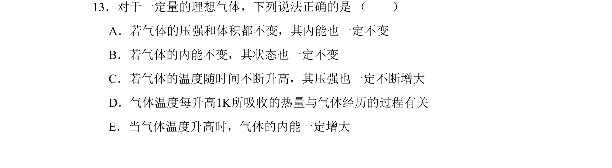
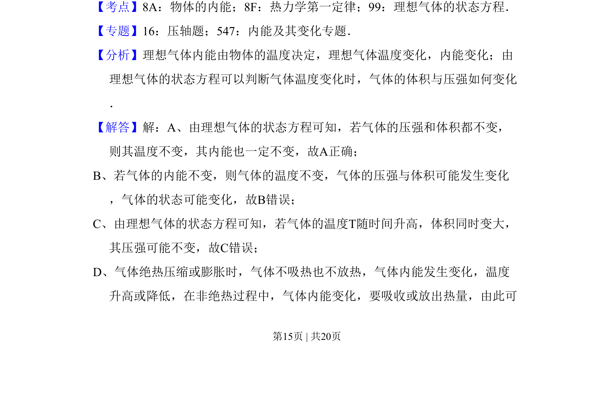
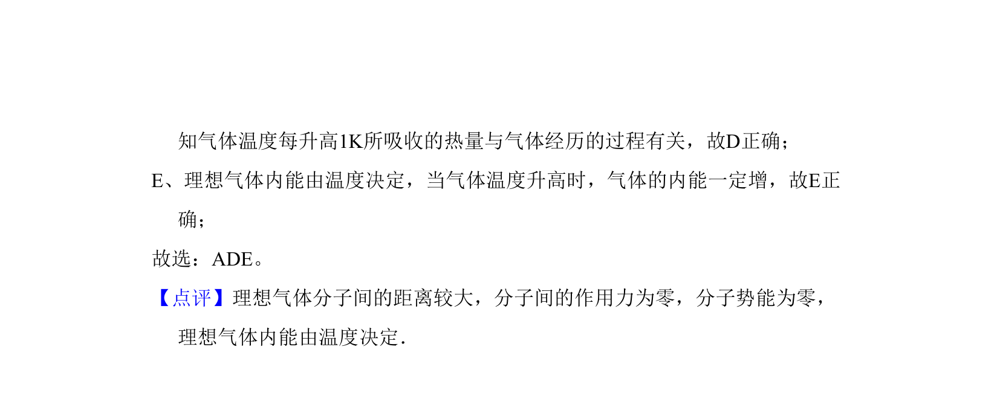

## 题面

## 摘要

考查理想气体状态方程、内能与热力学第一定律的综合判断。

## 关联考点

- [[446-理想气体状态方程|理想气体的状态方程]]
- [[440-热力学第一定律|热力学第一定律]]
- [[127-内能|内能]]

## 答案与解析

> 📄 原 PDF 第 15 页：`素材/真题/吉林/2008-2024·（吉林）物理高考真题/2011年高考物理试卷（新课标）（解析卷）.pdf`

<!-- 题干文本-start -->
## 题干文本
13．对于一定量的理想气体，下列说法正确的是 （　　）
A．若气体的压强和体积都不变，其内能也一定不变
B．若气体的内能不变，其状态也一定不变
C．若气体的温度随时间不断升高，其压强也一定不断增大
D．气体温度每升高1K所吸收的热量与气体经历的过程有关
E．当气体温度升高时，气体的内能一定增大
<!-- 题干文本-end -->

<!-- 解析文本-start -->
## 解析文本
【考点】8A：物体的内能；8F：热力学第一定律；99：理想气体的状态方程．菁优网版权所有
【专题】16：压轴题；547：内能及其变化专题．
【分析】理想气体内能由物体的温度决定，理想气体温度变化，内能变化；由
理想气体的状态方程可以判断气体温度变化时，气体的体积与压强如何变化
．
【解答】解：A、由理想气体的状态方程可知，若气体的压强和体积都不变，
则其温度不变，其内能也一定不变，故A正确；
B、若气体的内能不变，则气体的温度不变，气体的压强与体积可能发生变化
，气体的状态可能变化，故B错误；
C、由理想气体的状态方程可知，若气体的温度T随时间升高，体积同时变大，
其压强可能不变，故C错误；
D、气体绝热压缩或膨胀时，气体不吸热也不放热，气体内能发生变化，温度
升高或降低，在非绝热过程中，气体内能变化，要吸收或放出热量，由此可
<!-- 解析文本-end -->
