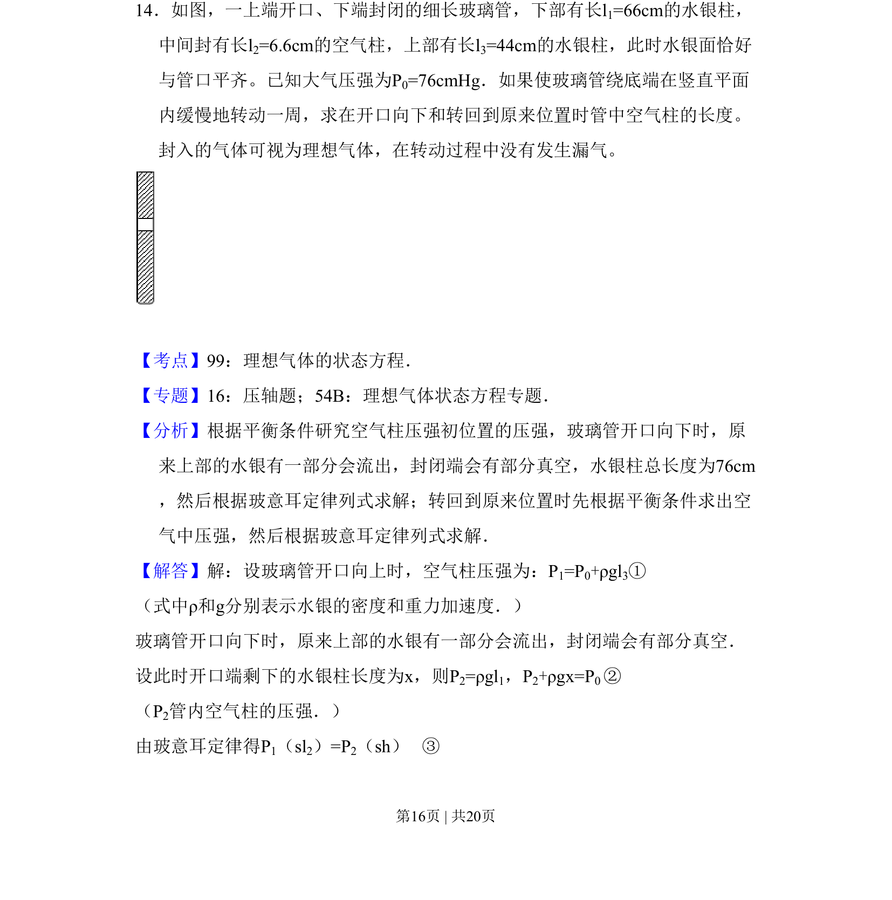
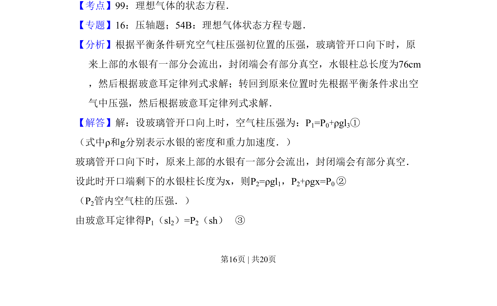
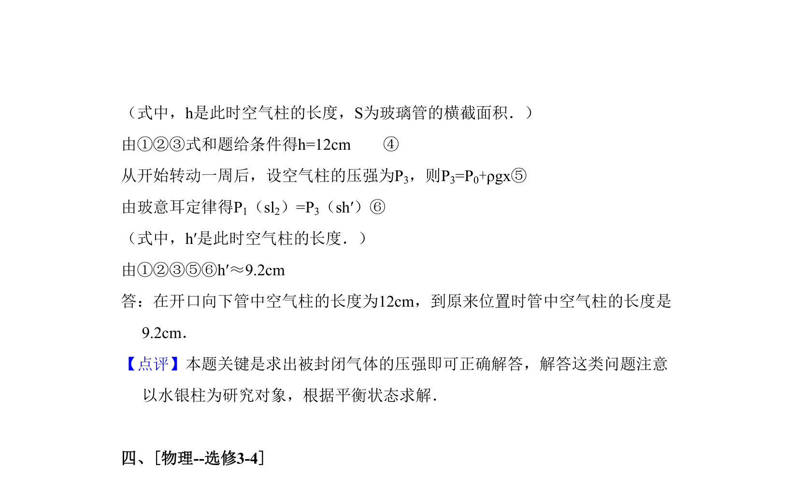

## 题面

## 摘要

玻璃管转动过程中理想气体状态变化及压强平衡问题

## 关联考点

- [[483-理想气体的状态方程|理想气体的状态方程]]
- [[444-玻意耳定律|玻意耳定律]]
- [[549-压强平衡|压强平衡]]

## 答案与解析

> 📄 原 PDF 第 16 页：`素材/真题/吉林/2008-2024·（吉林）物理高考真题/2011年高考物理试卷（新课标）（解析卷）.pdf`
