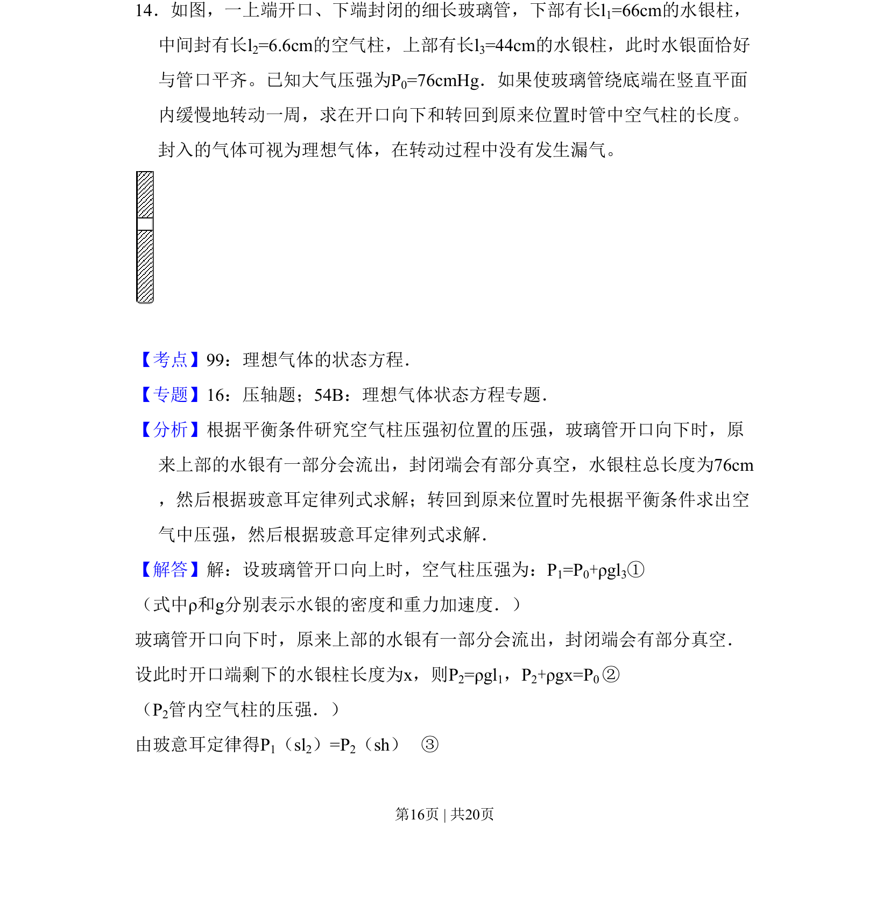
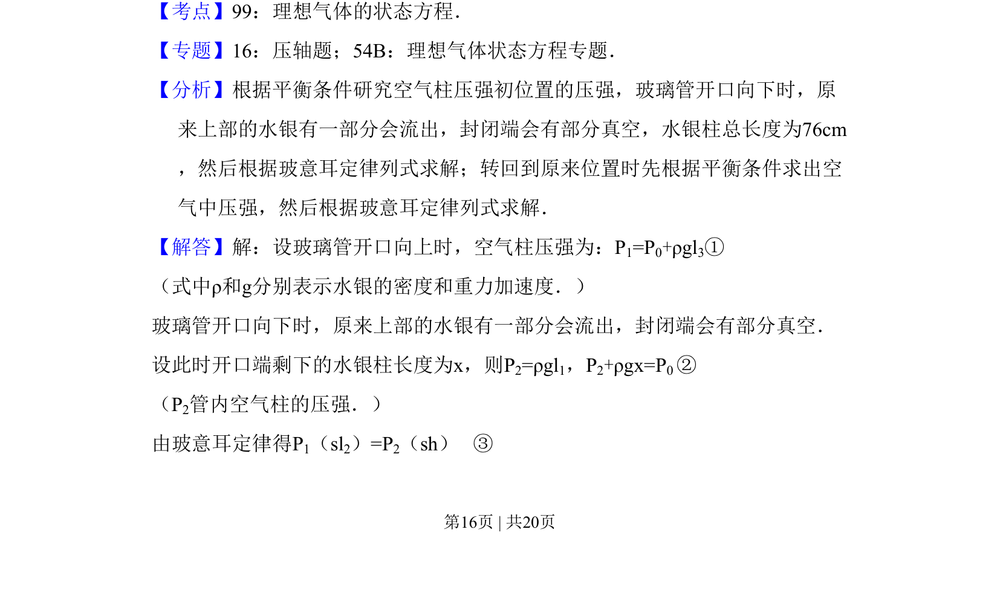
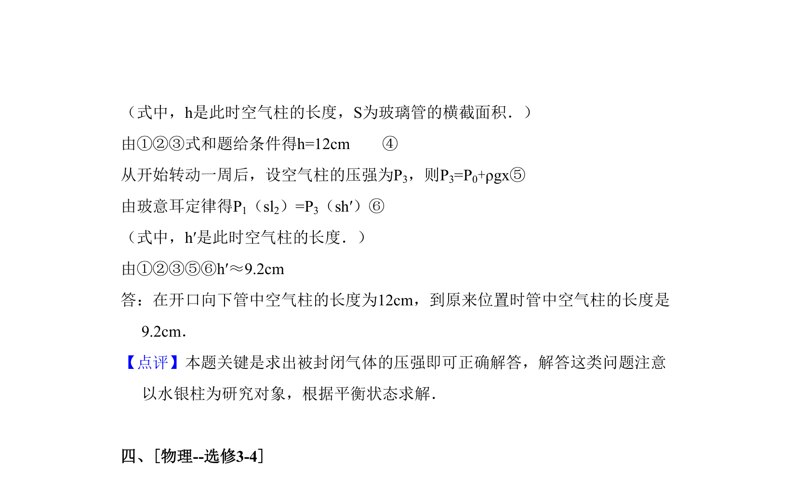

## 题面

## 摘要

玻璃管转动过程中理想气体状态变化及压强平衡问题

## 关联考点

- [[446-理想气体状态方程|理想气体的状态方程]]
- [[444-玻意耳定律|玻意耳定律]]
- [[549-压强平衡|压强平衡]]

## 答案与解析

> 📄 原 PDF 第 16 页：`素材/真题/吉林/2008-2024·（吉林）物理高考真题/2011年高考物理试卷（新课标）（解析卷）.pdf`

<!-- 题干文本-start -->
## 题干文本
14．如图，一上端开口、下端封闭的细长玻璃管，下部有长l1=66cm的水银柱，
中间封有长l2=6.6cm的空气柱，上部有长l3=44cm的水银柱，此时水银面恰好
与管口平齐。已知大气压强为P0=76cmHg．如果使玻璃管绕底端在竖直平面
内缓慢地转动一周，求在开口向下和转回到原来位置时管中空气柱的长度。
封入的气体可视为理想气体，在转动过程中没有发生漏气。
<!-- 题干文本-end -->

<!-- 解析文本-start -->
## 解析文本
【考点】99：理想气体的状态方程．菁优网版权所有
【专题】16：压轴题；54B：理想气体状态方程专题．
【分析】根据平衡条件研究空气柱压强初位置的压强，玻璃管开口向下时，原
来上部的水银有一部分会流出，封闭端会有部分真空，水银柱总长度为76cm
，然后根据玻意耳定律列式求解；转回到原来位置时先根据平衡条件求出空
气中压强，然后根据玻意耳定律列式求解．
【解答】解：设玻璃管开口向上时，空气柱压强为：P1=P0+ρgl3①
（式中ρ和g分别表示水银的密度和重力加速度．）
玻璃管开口向下时，原来上部的水银有一部分会流出，封闭端会有部分真空．
设此时开口端剩下的水银柱长度为x，则P2=ρgl1，P2+ρgx=P0 ②
（P2管内空气柱的压强．）
由玻意耳定律得P1（sl2）=P2（sh）   ③
<!-- 解析文本-end -->
