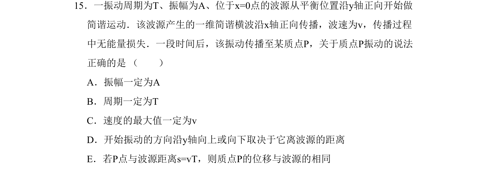
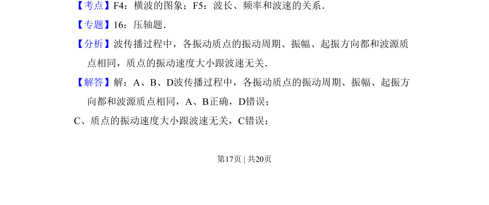
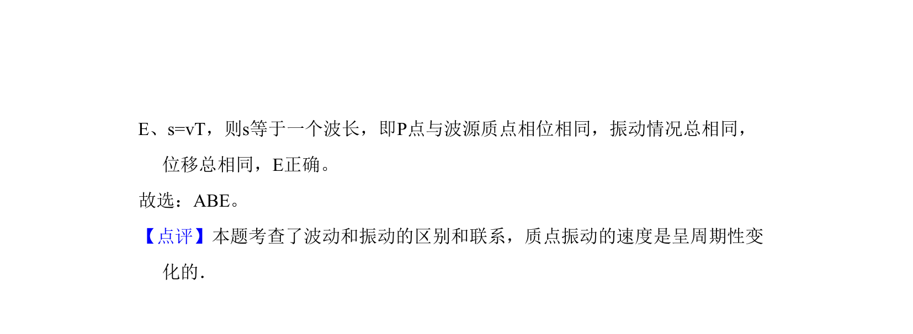

## 题面

## 摘要

考查简谐横波传播中质点振动的振幅、周期、起振方向与波源的关系。

## 关联考点

- [[373-简谐运动|简谐运动]]
- [[363-横波与纵波|横波]]
- [[370-波长|波长]]
- [[749-频率和波速的关系|频率和波速的关系]]

## 答案与解析

> 📄 原 PDF 第 17 页：`素材/真题/吉林/2008-2024·（吉林）物理高考真题/2011年高考物理试卷（新课标）（解析卷）.pdf`
