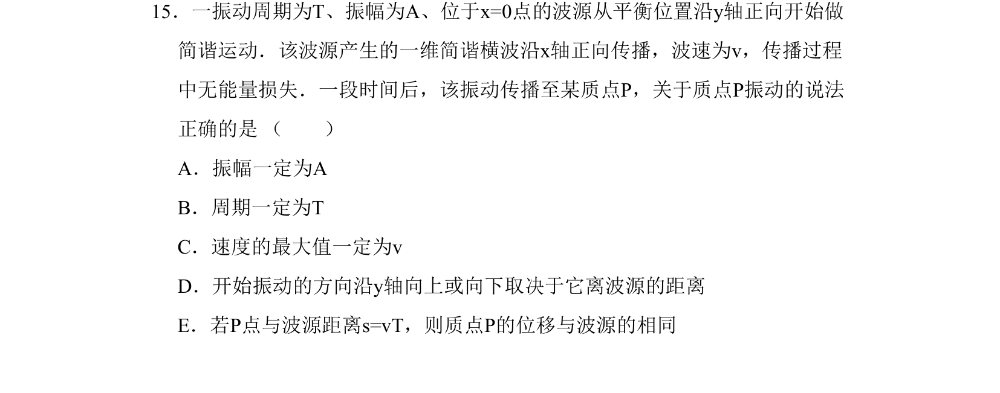
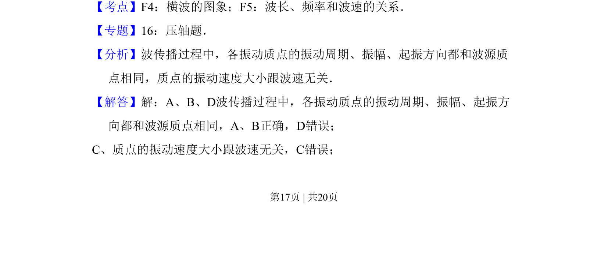
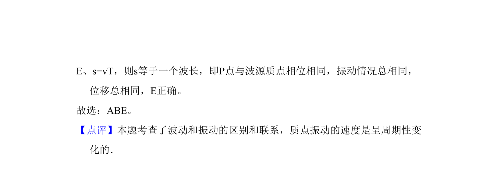

## 题面

## 摘要

考查简谐横波传播中质点振动的振幅、周期、起振方向与波源的关系。

## 关联考点

- [[373-简谐运动|简谐运动]]
- [[363-横波与纵波|横波]]
- [[370-波长|波长]]
- [[749-频率和波速的关系|频率和波速的关系]]

## 答案与解析

> 📄 原 PDF 第 17 页：`素材/真题/吉林/2008-2024·（吉林）物理高考真题/2011年高考物理试卷（新课标）（解析卷）.pdf`

<!-- 题干文本-start -->
## 题干文本
15．一振动周期为T、振幅为A、位于x=0点的波源从平衡位置沿y轴正向开始做
简谐运动．该波源产生的一维简谐横波沿x轴正向传播，波速为v，传播过程
中无能量损失．一段时间后，该振动传播至某质点P，关于质点P振动的说法
正确的是 （　　）
A．振幅一定为A
B．周期一定为T
C．速度的最大值一定为v
D．开始振动的方向沿y轴向上或向下取决于它离波源的距离
E．若P点与波源距离s=vT，则质点P的位移与波源的相同
<!-- 题干文本-end -->

<!-- 解析文本-start -->
## 解析文本
【考点】F4：横波的图象；F5：波长、频率和波速的关系．菁优网版权所有
【专题】16：压轴题．
【分析】波传播过程中，各振动质点的振动周期、振幅、起振方向都和波源质
点相同，质点的振动速度大小跟波速无关．
【解答】解：A、B、D波传播过程中，各振动质点的振动周期、振幅、起振方
向都和波源质点相同，A、B正确，D错误；
C、质点的振动速度大小跟波速无关，C错误；
<!-- 解析文本-end -->
