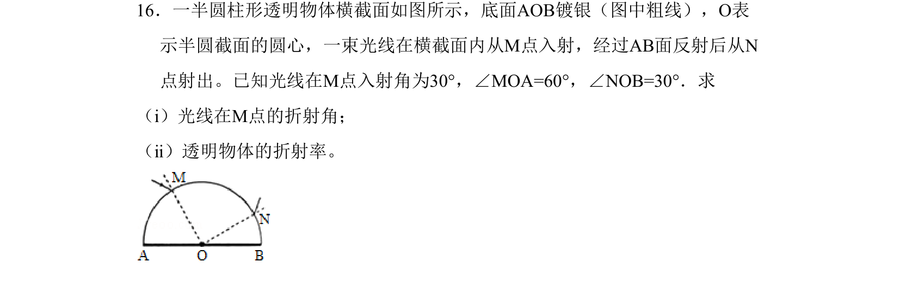
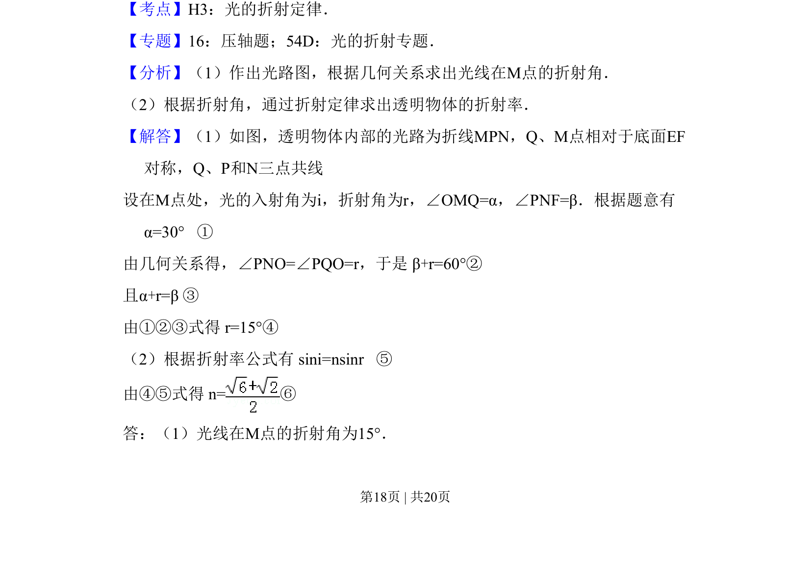
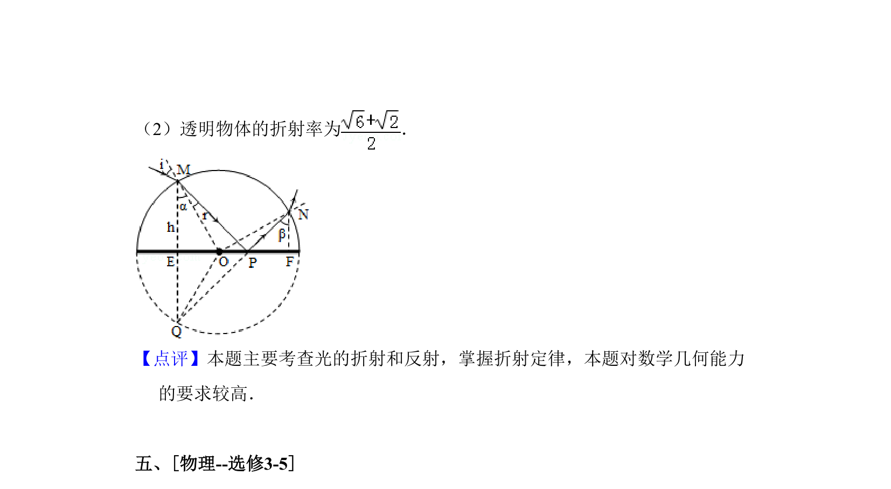

## 题面

## 摘要

考查光的折射定律，通过几何关系求折射角并计算透明物体的折射率。

## 关联考点

- [[520-光的折射定律|光的折射定律]]
- [[455-几何光学|几何光学]]
- [[471-折射率计算|折射率计算]]

## 答案与解析

> 📄 原 PDF 第 18 页：`素材/真题/吉林/2008-2024·（吉林）物理高考真题/2011年高考物理试卷（新课标）（解析卷）.pdf`
