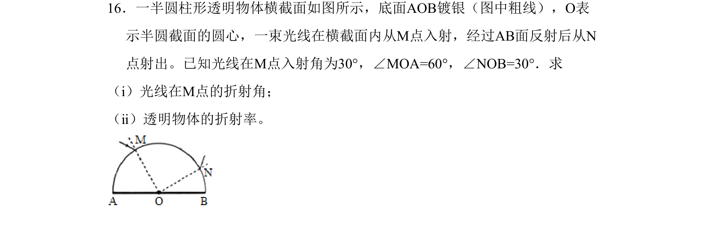
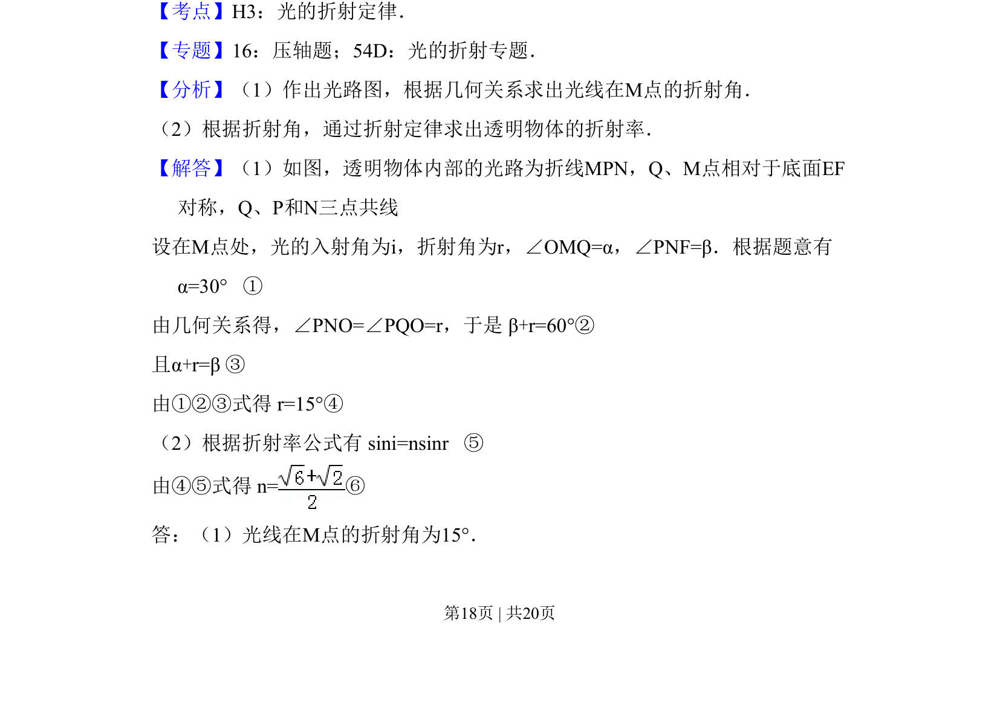
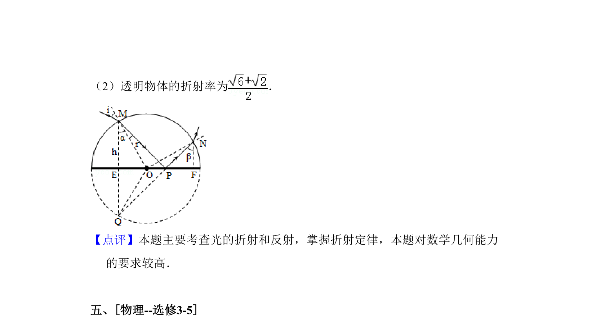

## 题面

## 摘要

考查光的折射定律，通过几何关系求折射角并计算透明物体的折射率。

## 关联考点

- [[520-光的折射定律|光的折射定律]]
- [[455-几何光学|几何光学]]
- [[471-折射率计算|折射率计算]]

## 答案与解析

> 📄 原 PDF 第 18 页：`素材/真题/吉林/2008-2024·（吉林）物理高考真题/2011年高考物理试卷（新课标）（解析卷）.pdf`

<!-- 题干文本-start -->
## 题干文本
16．一半圆柱形透明物体横截面如图所示，底面AOB镀银（图中粗线），O表
示半圆截面的圆心，一束光线在横截面内从M点入射，经过AB面反射后从N
点射出。已知光线在M点入射角为30°，∠MOA=60°，∠NOB=30°．求
（ⅰ）光线在M点的折射角；
（ⅱ）透明物体的折射率。
<!-- 题干文本-end -->

<!-- 解析文本-start -->
## 解析文本
【考点】H3：光的折射定律．菁优网版权所有
【专题】16：压轴题；54D：光的折射专题．
【分析】（1）作出光路图，根据几何关系求出光线在M点的折射角．
（2）根据折射角，通过折射定律求出透明物体的折射率．
【解答】（1）如图，透明物体内部的光路为折线MPN，Q、M点相对于底面EF
对称，Q、P和N三点共线
设在M点处，光的入射角为i，折射角为r，∠OMQ=α，∠PNF=β．根据题意有 
α=30°   ①
由几何关系得，∠PNO=∠PQO=r，于是 β+r=60°②
且α+r=β ③
由①②③式得 r=15°④
（2）根据折射率公式有 sini=nsinr   ⑤
由④⑤式得 n=⑥
答：（1）光线在M点的折射角为15°．
<!-- 解析文本-end -->
