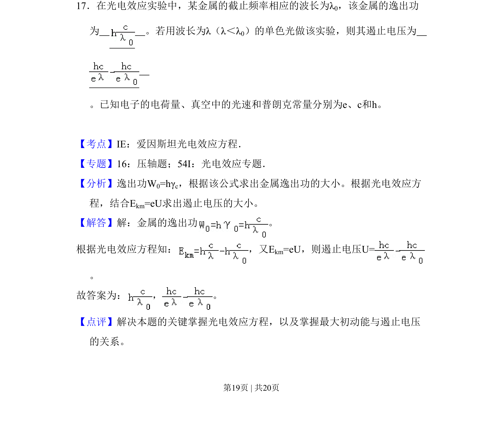
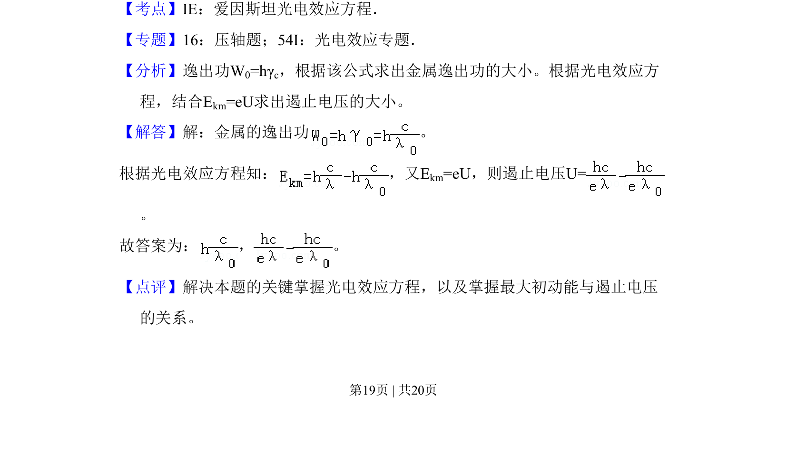

## 题面

## 摘要

考查爱因斯坦光电效应方程，计算金属逸出功和遏止电压。

## 关联考点

- [[660-爱因斯坦光电效应方程|爱因斯坦光电效应方程]]
- [[745-逸出功|逸出功]]
- [[781-遏止电压|遏止电压]]

## 答案与解析

> 📄 原 PDF 第 19 页：`素材/真题/吉林/2008-2024·（吉林）物理高考真题/2011年高考物理试卷（新课标）（解析卷）.pdf`
