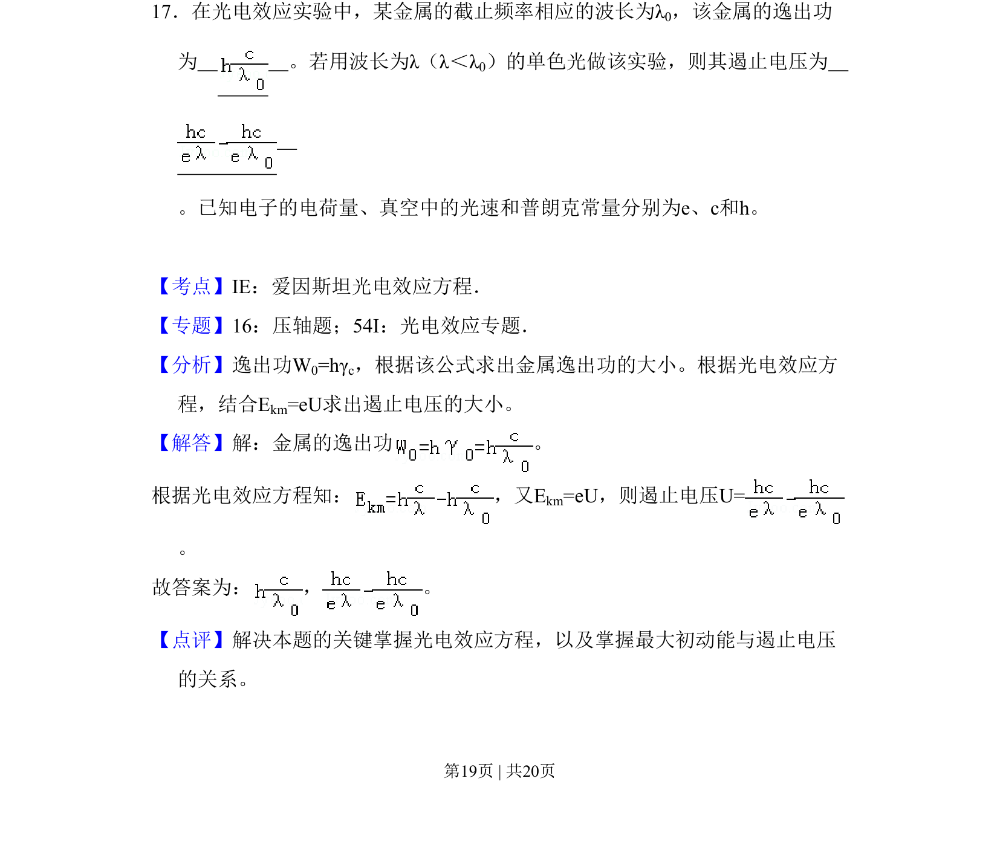
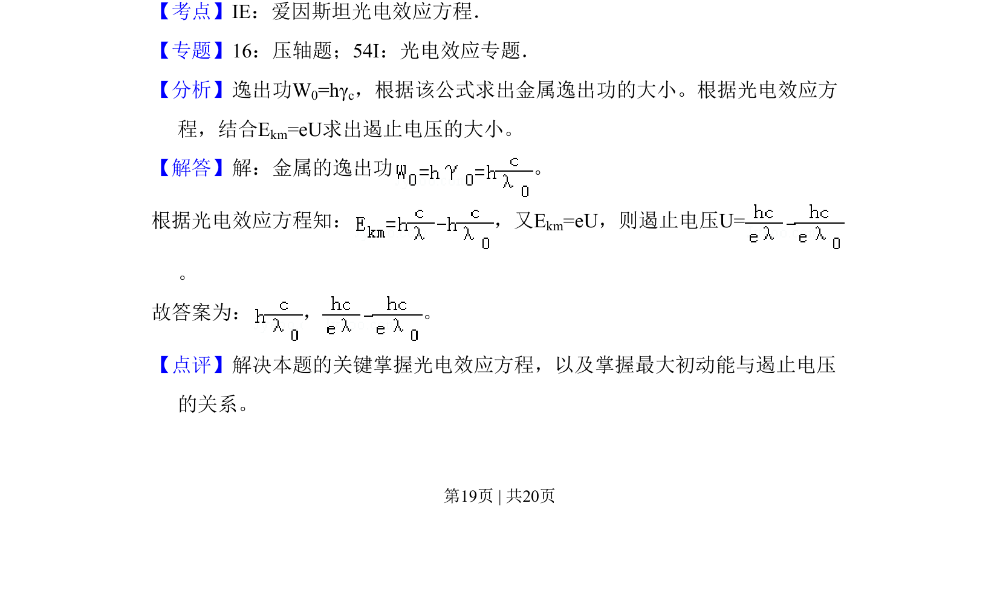

## 题面

## 摘要

考查爱因斯坦光电效应方程，计算金属逸出功和遏止电压。

## 关联考点

- [[660-爱因斯坦光电效应方程|爱因斯坦光电效应方程]]
- [[745-逸出功|逸出功]]
- [[781-遏止电压|遏止电压]]

## 答案与解析

> 📄 原 PDF 第 19 页：`素材/真题/吉林/2008-2024·（吉林）物理高考真题/2011年高考物理试卷（新课标）（解析卷）.pdf`

<!-- 题干文本-start -->
## 题干文本
17．在光电效应实验中，某金属的截止频率相应的波长为λ0，该金属的逸出功
为　 　。若用波长为λ（λ＜λ0）的单色光做该实验，则其遏止电压为　
　
。已知电子的电荷量、真空中的光速和普朗克常量分别为e、c和h。
<!-- 题干文本-end -->

<!-- 解析文本-start -->
## 解析文本
【考点】IE：爱因斯坦光电效应方程．菁优网版权所有
【专题】16：压轴题；54I：光电效应专题．
【分析】逸出功W0=hγc，根据该公式求出金属逸出功的大小。根据光电效应方
程，结合Ekm=eU求出遏止电压的大小。
【解答】解：金属的逸出功 。
根据光电效应方程知： ，又E km=eU，则遏止电压U=
。
故答案为： ， 。
【点评】解决本题的关键掌握光电效应方程，以及掌握最大初动能与遏止电压
的关系。
<!-- 解析文本-end -->
