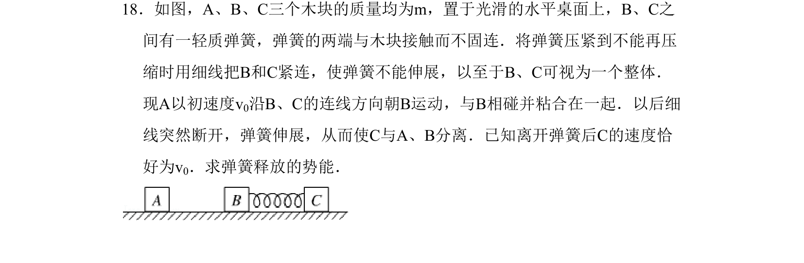
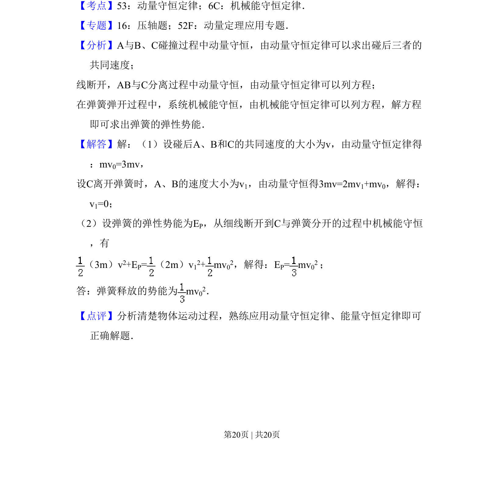

## 题面

## 摘要

碰撞与弹簧问题中的动量守恒和机械能守恒综合应用

## 关联考点

- [[347-动量守恒定律|动量守恒定律]]
- [[085-机械能守恒-初中|机械能守恒定律]]

## 答案与解析

> 📄 原 PDF 第 20 页：`素材/真题/吉林/2008-2024·（吉林）物理高考真题/2011年高考物理试卷（新课标）（解析卷）.pdf`

<!-- 题干文本-start -->
## 题干文本
18．如图，A、B、C三个木块的质量均为m，置于光滑的水平桌面上，B、C之
间有一轻质弹簧，弹簧的两端与木块接触而不固连．将弹簧压紧到不能再压
缩时用细线把B和C紧连，使弹簧不能伸展，以至于B、C可视为一个整体．
现A以初速度v0沿B、C的连线方向朝B运动，与B相碰并粘合在一起．以后细
线突然断开，弹簧伸展，从而使C与A、B分离．已知离开弹簧后C的速度恰
好为v0．求弹簧释放的势能．
<!-- 题干文本-end -->

<!-- 解析文本-start -->
## 解析文本
【考点】53：动量守恒定律；6C：机械能守恒定律．菁优网版权所有
【专题】16：压轴题；52F：动量定理应用专题．
【分析】A与B、C碰撞过程中动量守恒，由动量守恒定律可以求出碰后三者的
共同速度；
线断开，AB与C分离过程中动量守恒，由动量守恒定律可以列方程；
在弹簧弹开过程中，系统机械能守恒，由机械能守恒定律可以列方程，解方程
即可求出弹簧的弹性势能．
【解答】解：（1）设碰后A、B和C的共同速度的大小为v，由动量守恒定律得
：mv0=3mv，
设C离开弹簧时，A、B的速度大小为v1，由动量守恒得3mv=2mv1+mv0，解得：
v1=0； 
（2）设弹簧的弹性势能为EP，从细线断开到C与弹簧分开的过程中机械能守恒
，有
（3m）v2+EP=（2m）v 12+mv 02，解得：EP= mv 02 ；
答：弹簧释放的势能为mv 02．
【点评】分析清楚物体运动过程，熟练应用动量守恒定律、能量守恒定律即可
正确解题．
<!-- 解析文本-end -->
