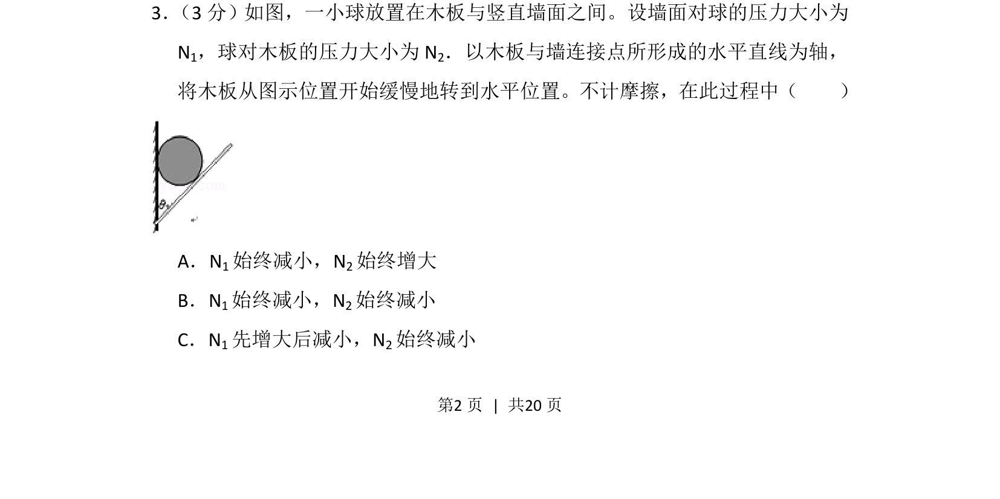

## 题面

## 摘要

本题通过动态平衡模型考查力的分解与合成，借助图解法分析两弹力随木板转动的大小变化。

## 关联考点

- [[矢量运算]]
- [[动态平衡图解法]]
- [[432-导数与函数单调性|函数单调性]]

## 答案与解析

> 📄 原 PDF 第 2 页：`素材/真题/吉林/2008-2024·（吉林）物理高考真题/2012年高考物理试卷（新课标）（解析卷）.pdf`
