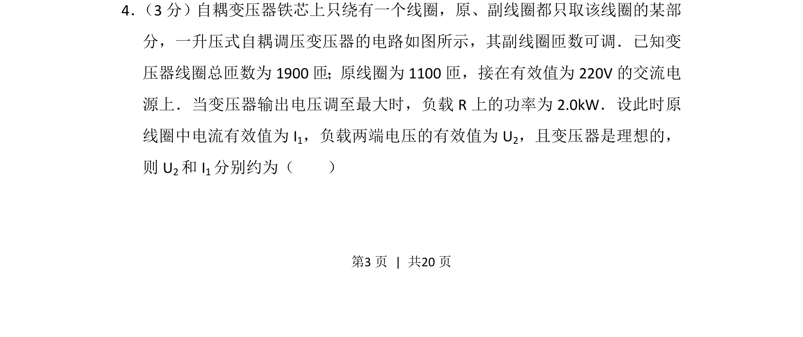
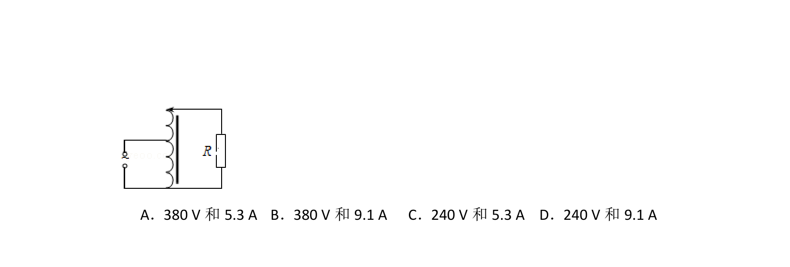
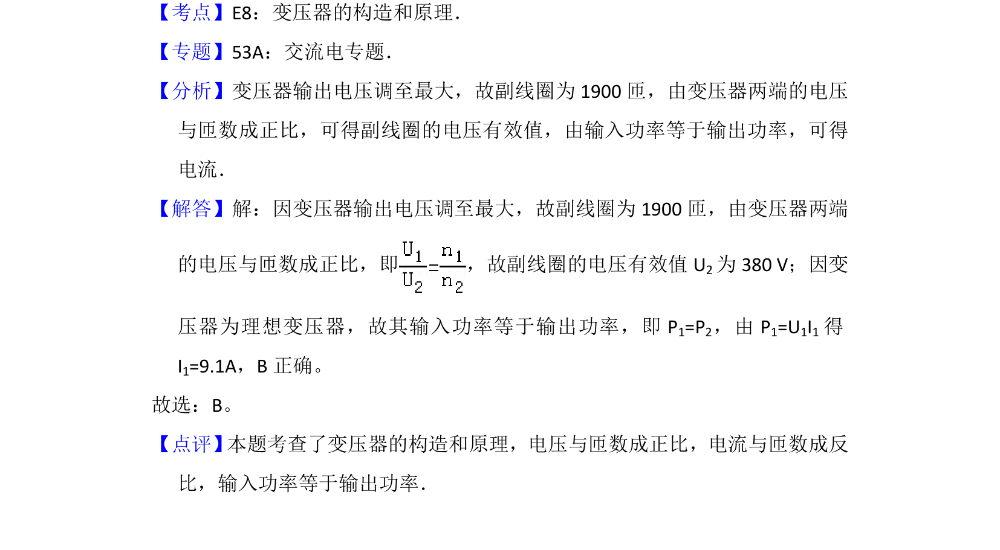

## 题面

## 摘要

该题考查理想变压器电压、电流与匝数关系及电功率计算。

## 关联考点

- [[774-变压器原理|变压器原理]]
- [[159-电功率|电功率]]
- [[624-有效值|有效值]]

## 答案与解析

> 📄 原 PDF 第 3 页：`素材/真题/吉林/2008-2024·（吉林）物理高考真题/2012年高考物理试卷（新课标）（解析卷）.pdf`

<!-- 题干文本-start -->
## 题干文本
4． （3分）自耦变压器铁芯上只绕有一个线圈，原、副线圈都只取该线圈的某部
分，一升压式自耦调压变压器的电路如图所示，其副线圈匝数可调．已知变
压器线圈总匝数为1900匝；原线圈为1100匝，接在有效值为220V的交流电
源上．当变压器输出电压调至最大时，负载R上的功率为2.0kW．设此时原
线圈中电流有效值为I 1，负载两端电压的有效值为U 2，且变压器是理想的，
则U 2和I 1分别约为（　　）
<!-- 题干文本-end -->

<!-- 解析文本-start -->
## 解析文本

<!-- 解析文本-end -->
