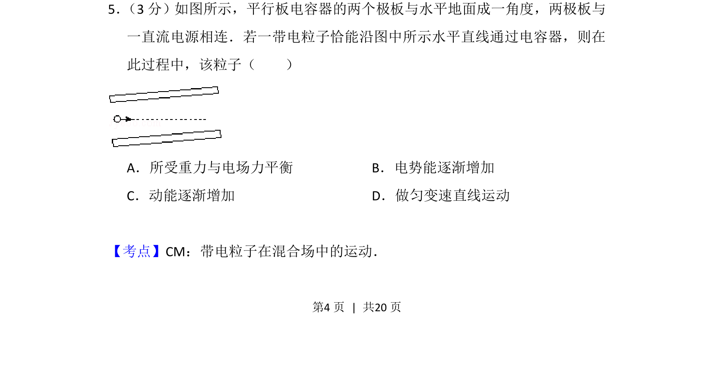
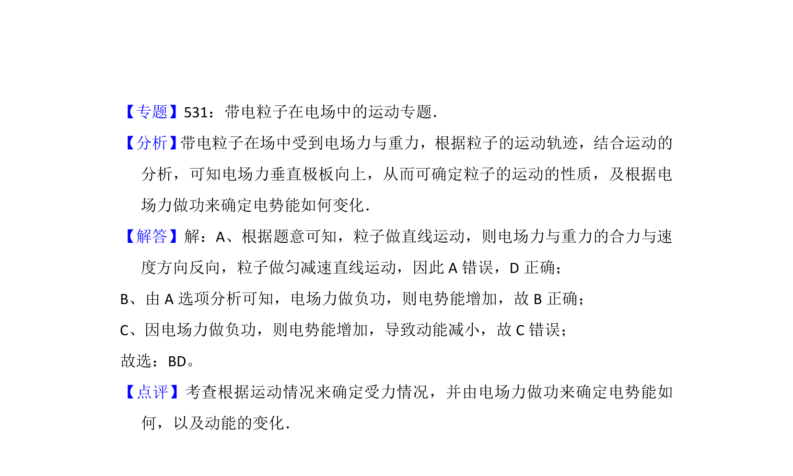

## 题面

## 摘要

该题考查平行板电容器中带电粒子在电场和重力场复合场中的直线运动分析。

## 关联考点

- [[596-带电粒子在混合场中的运动|带电粒子在混合场中的运动]]

## 答案与解析

> 📄 原 PDF 第 4 页：`素材/真题/吉林/2008-2024·（吉林）物理高考真题/2012年高考物理试卷（新课标）（解析卷）.pdf`

<!-- 题干文本-start -->
## 题干文本
5． （3分）如图所示，平行板电容器的两个极板与水平地面成一角度，两极板与
一直流电源相连．若一带电粒子恰能沿图中所示水平直线通过电容器，则在
此过程中，该粒子（　　）
A．所受重力与电场力平衡B．电势能逐渐增加
C．动能逐渐增加D．做匀变速直线运动
<!-- 题干文本-end -->

<!-- 解析文本-start -->
## 解析文本
【考点】CM：带电粒子在混合场中的运动．菁优网版权所有
<!-- 解析文本-end -->
