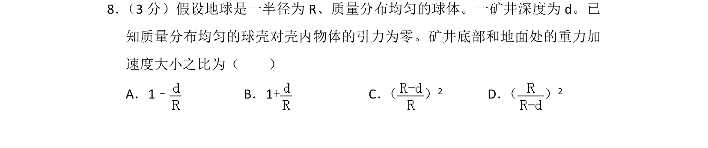
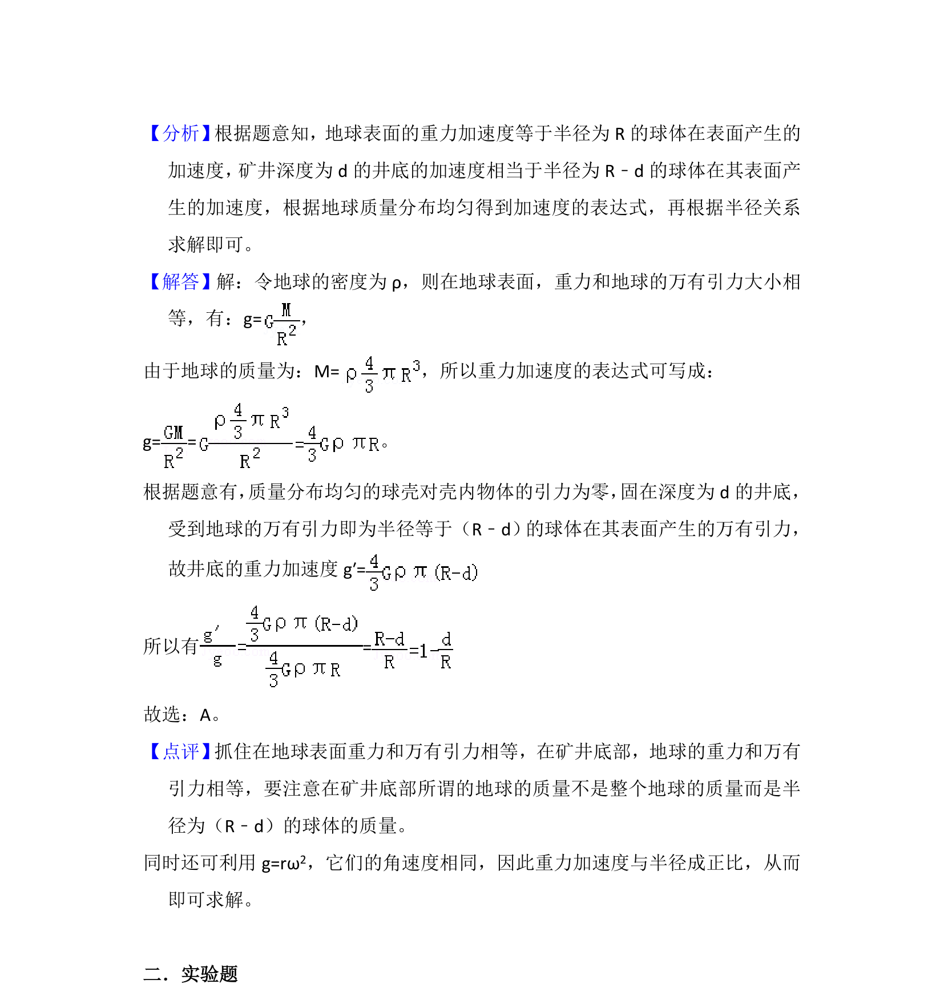

## 题面

## 摘要

考察质量分布均匀的球体内部重力加速度与距球心距离的关系，利用球壳对内部物体引力为零的性质求比值。

## 关联考点

- [[246-万有引力定律|万有引力定律]]
- [[115-重力加速度-初中|重力加速度]]
- [[727-质量分布均匀球体|质量分布均匀球体]]

## 答案与解析

> 📄 原 PDF 第 7 页：`素材/真题/吉林/2008-2024·（吉林）物理高考真题/2012年高考物理试卷（新课标）（解析卷）.pdf`
