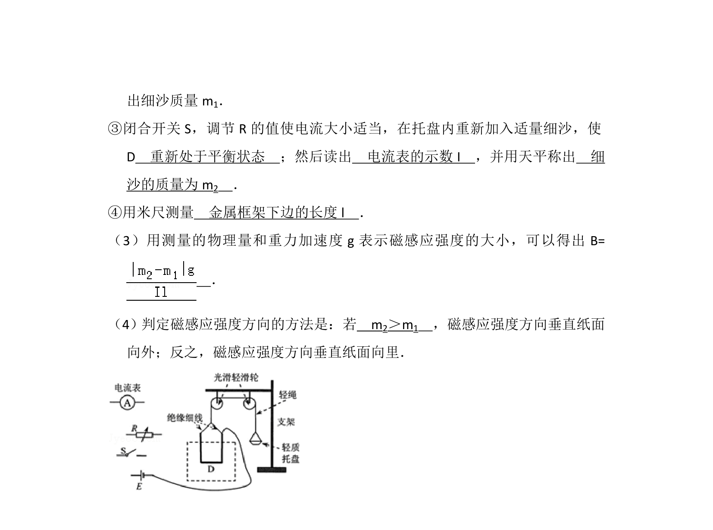
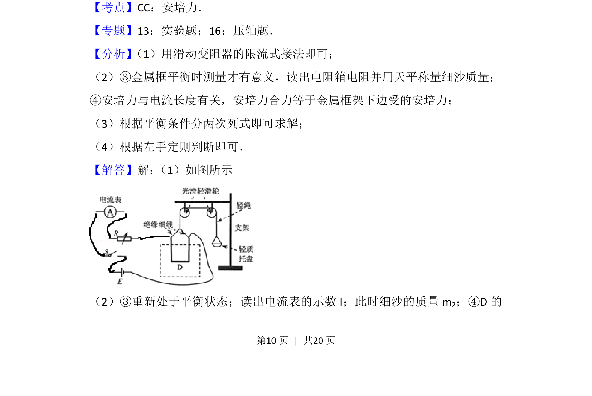

## 题面

## 摘要

通过安培力平衡法测量匀强磁场的磁感应强度及方向，涉及电路连接与力学平衡操作。

## 关联考点

- [[188-磁场对通电导体的作用|安培力]]
- [[208-共点力平衡|共点力平衡]]
- [[323-磁感应强度|磁感应强度]]

## 答案与解析

> 📄 原 PDF 第 9 页：`素材/真题/吉林/2008-2024·（吉林）物理高考真题/2012年高考物理试卷（新课标）（解析卷）.pdf`
