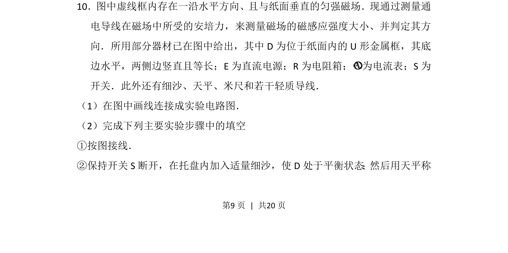
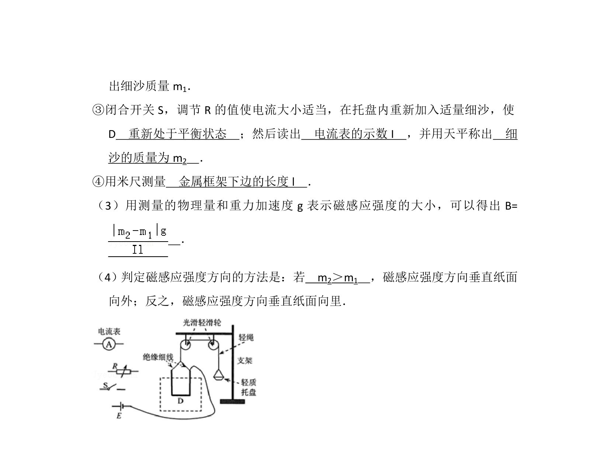
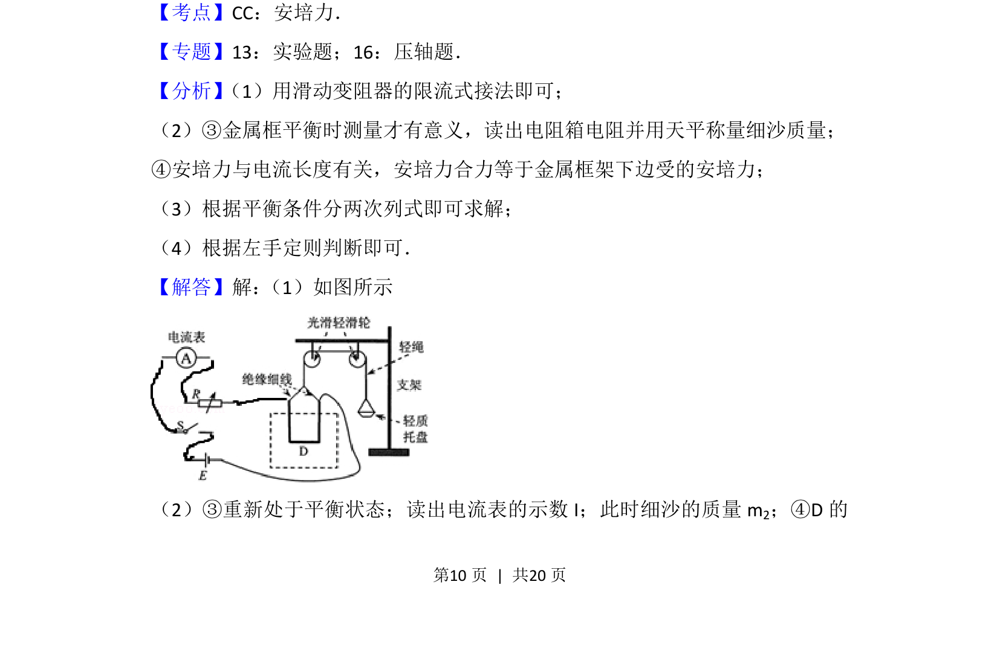
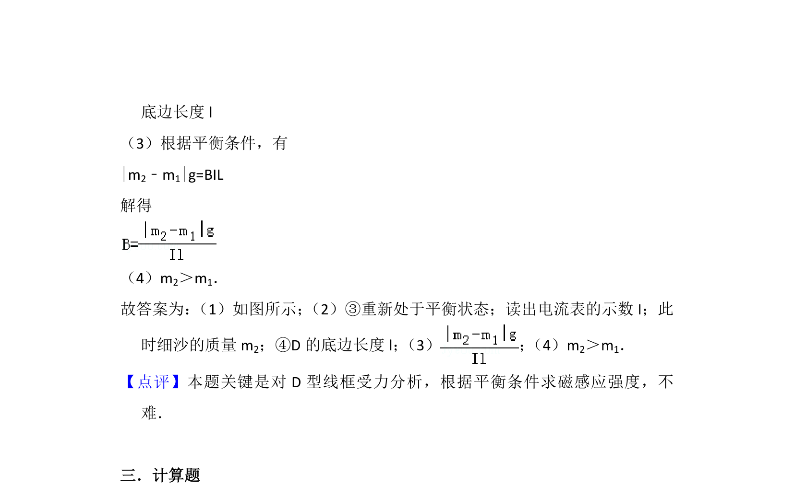

## 题面

## 摘要

通过安培力平衡法测量匀强磁场的磁感应强度及方向，涉及电路连接与力学平衡操作。

## 关联考点

- [[188-磁场对通电导体的作用|安培力]]
- [[208-共点力平衡|共点力平衡]]
- [[323-磁感应强度|磁感应强度]]

## 答案与解析

> 📄 原 PDF 第 9 页：`素材/真题/吉林/2008-2024·（吉林）物理高考真题/2012年高考物理试卷（新课标）（解析卷）.pdf`

<!-- 题干文本-start -->
## 题干文本
10．图中虚线框内存在一沿水平方向、且与纸面垂直的匀强磁场．现通过测量通
电导线在磁场中所受的安培力，来测量磁场的磁感应强度大小、并判定其方
向．所用部分器材已在图中给出，其中D为位于纸面内的U形金属框，其底
边水平，两侧边竖直且等长；E为直流电源；R为电阻箱； 为电流表；S为
开关．此外还有细沙、天平、米尺和若干轻质导线．
（1）在图中画线连接成实验电路图．
（2）完成下列主要实验步骤中的填空
①按图接线．
②保持开关S断开，在托盘内加入适量细沙，使D处于平衡状态；然后用天平称
<!-- 题干文本-end -->

<!-- 解析文本-start -->
## 解析文本

<!-- 解析文本-end -->
