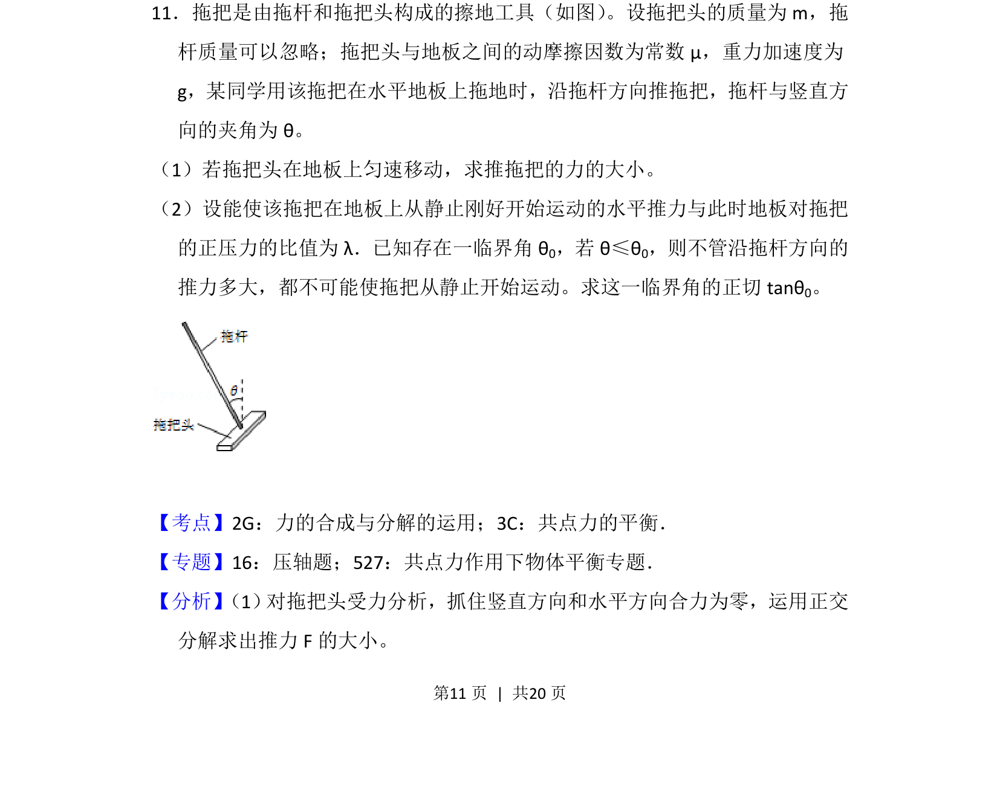
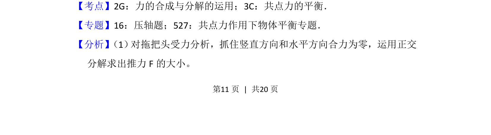
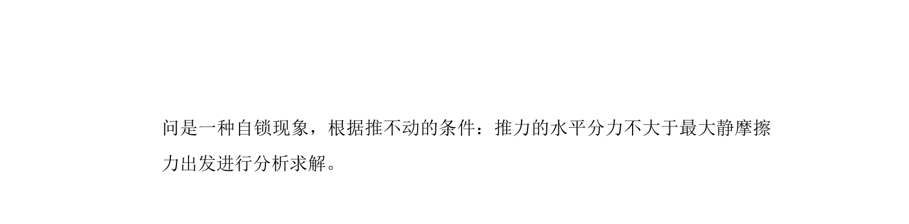

## 题面

## 摘要

考查拖把在摩擦力作用下的平衡问题，涉及力的合成与分解及临界角分析。

## 关联考点

- [[532-力的合成与分解|力的合成与分解]]
- [[208-共点力平衡|共点力平衡]]
- [[081-摩擦力|摩擦力]]

## 答案与解析

> 📄 原 PDF 第 11 页：`素材/真题/吉林/2008-2024·（吉林）物理高考真题/2012年高考物理试卷（新课标）（解析卷）.pdf`
