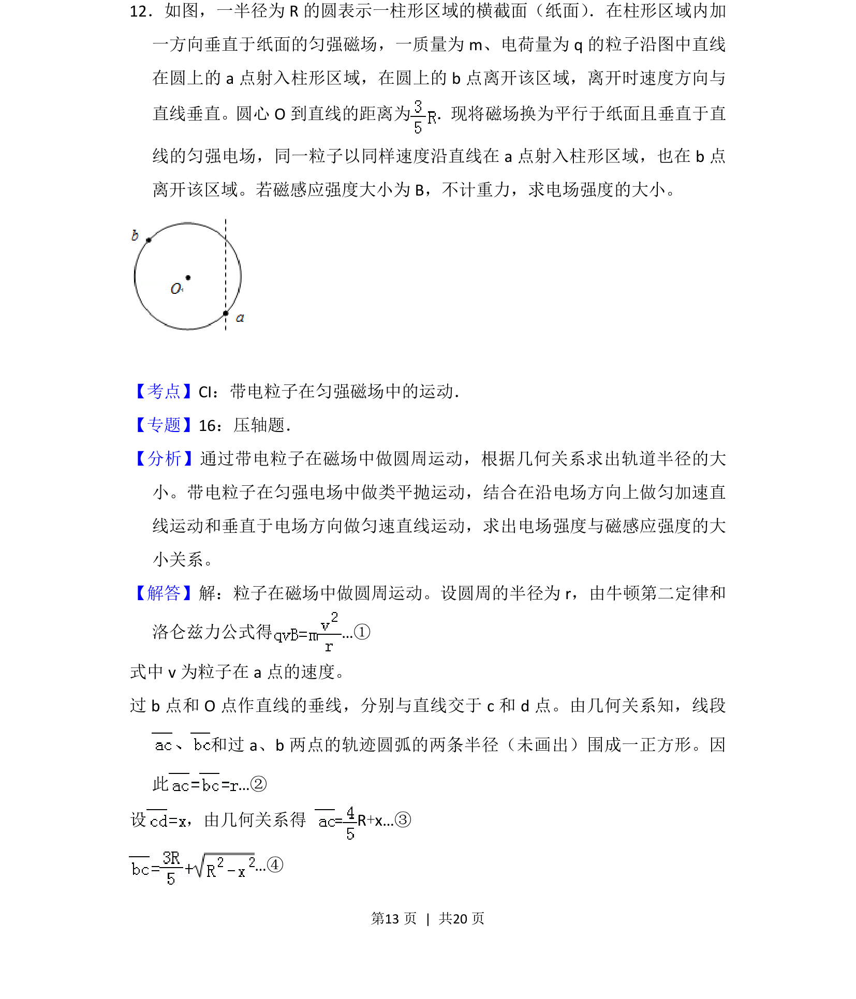

## 题面

## 摘要

带电粒子在磁场中做圆周运动、在电场中做类平抛运动，比较两场中运动求电场强度

## 关联考点

- [[带电粒子在匀强磁场中的运动]]
- [[带电粒子在匀强电场中的运动]]
- [[229-牛顿第二定律|牛顿第二定律]]
- [[304-洛伦兹力|洛伦兹力]]

## 答案与解析

> 📄 原 PDF 第 13 页：`素材/真题/吉林/2008-2024·（吉林）物理高考真题/2012年高考物理试卷（新课标）（解析卷）.pdf`
