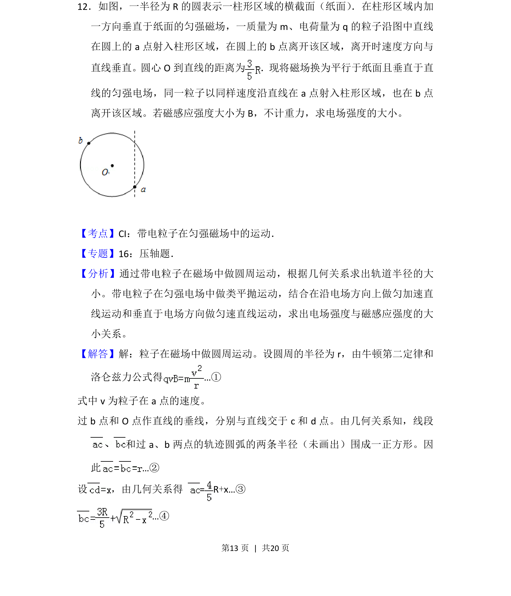
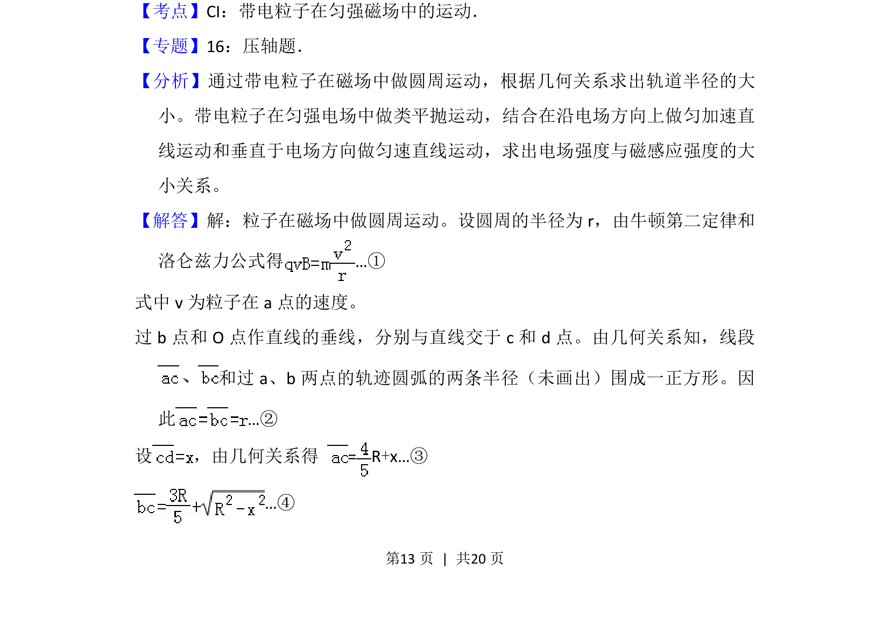
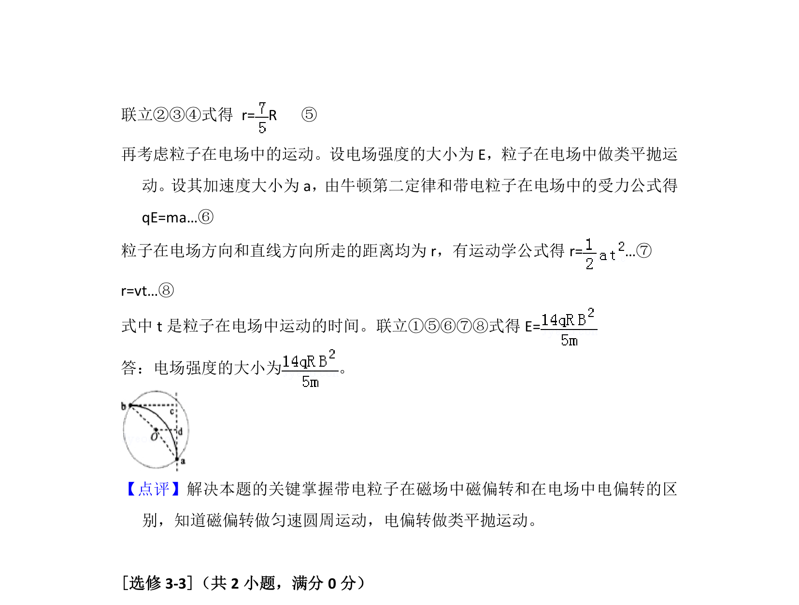

## 题面

## 摘要

带电粒子在磁场中做圆周运动、在电场中做类平抛运动，比较两场中运动求电场强度

## 关联考点

- [[595-带电粒子在匀强磁场中的运动|带电粒子在匀强磁场中的运动]]
- [[468-带电粒子在匀强电场中的运动|带电粒子在匀强电场中的运动]]
- [[229-牛顿第二定律|牛顿第二定律]]
- [[304-洛伦兹力|洛伦兹力]]

## 答案与解析

> 📄 原 PDF 第 13 页：`素材/真题/吉林/2008-2024·（吉林）物理高考真题/2012年高考物理试卷（新课标）（解析卷）.pdf`

<!-- 题干文本-start -->
## 题干文本
12．如图，一半径为R的圆表示一柱形区域的横截面（纸面） ．在柱形区域内加
一方向垂直于纸面的匀强磁场，一质量为m、电荷量为q的粒子沿图中直线
在圆上的a点射入柱形区域，在圆上的b点离开该区域，离开时速度方向与
直线垂直。圆心O到直线的距离为 ．现将磁场换为平行于纸面且垂直于直
线的匀强电场，同一粒子以同样速度沿直线在a点射入柱形区域，也在b点
离开该区域。若磁感应强度大小为B，不计重力，求电场强度的大小。
<!-- 题干文本-end -->

<!-- 解析文本-start -->
## 解析文本
【考点】CI：带电粒子在匀强磁场中的运动．菁优网版权所有
【专题】16：压轴题．
【分析】通过带电粒子在磁场中做圆周运动，根据几何关系求出轨道半径的大
小。带电粒子在匀强电场中做类平抛运动，结合在沿电场方向上做匀加速直
线运动和垂直于电场方向做匀速直线运动，求出电场强度与磁感应强度的大
小关系。
【解答】解：粒子在磁场中做圆周运动。设圆周的半径为r，由牛顿第二定律和
洛仑兹力公式得…①
式中v为粒子在a点的速度。
过b点和O点作直线的垂线，分别与直线交于c和d点。由几何关系知，线段 
和过a、b两点的轨迹圆弧的两条半径（未画出）围成一正方形。因
此…②
设 ，由几何关系得 = R+x…③
…④
<!-- 解析文本-end -->
